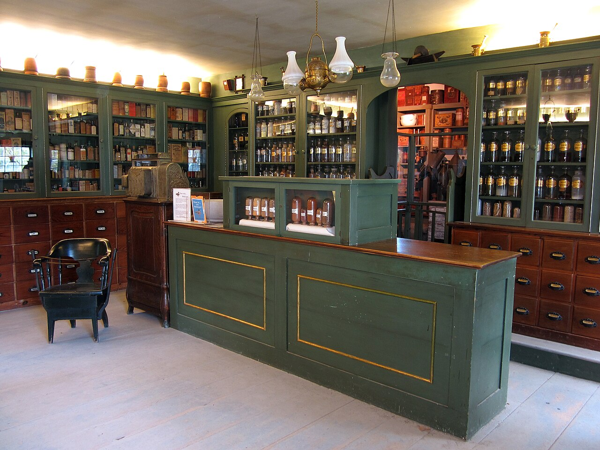
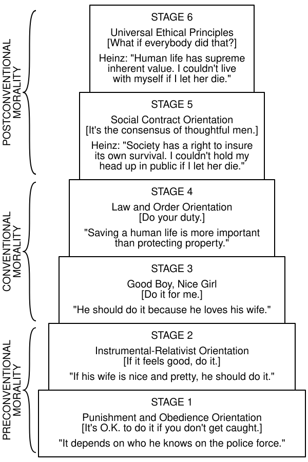
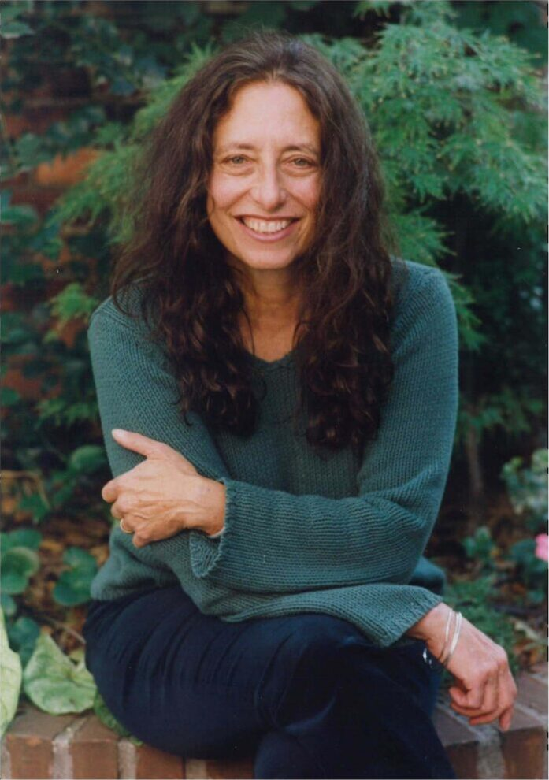
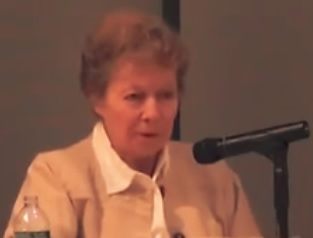

# Introduction to Care Ethics {.title-slide data-menu-title="Week 3, Day 2"}

CS 377, Week 3, Day 2 🟦 Illinois Medical District 🟦

---

# Introduction to Care Ethics {.title-slide .photo-title data-state="photo-title" background-image="../assets/blue-line-stops-better/stop09-illinois-medical-district-b.jpg" background-size="cover" data-menu-title="Week 3, Day 2"}

CS 377, Week 3, Day 2 🟦 Illinois Medical District 🟦

<!-- image source: Illinois Medical District station, via exp.com -->

---

## {.photo-only data-state="photo-only" background-image="../assets/blue-line-stops-better/stop09-illinois-medical-district-b.jpg" background-size="cover"}

---

## Agenda for Today

:::: columns
::: {.column width="55%"}
- Administrivia and questions
- Shuffle seats
- The Heinz dilemma
- A different voice
- The porcupine and the moles
- What is care?
:::

::: {.column width="40%"}

:::
::::

---

## 🔀 Seat Shuffle {.embed-slide}

::: {.embed-layout}
::: {.embed-copy}
- Shuffle seats!
- Enter a seed and shuffle

[Open in a new tab](https://doethics.fun/in-progress/visual-seat-shuffle.html)
:::

::: {.embed-frame style="position:absolute;top:0;right:0;bottom:52px;width:38%;margin:0;border-radius:0 6px 6px 0;border:2px solid #d8d8d8;"}
<iframe
  src="../in-progress/visual-seat-shuffle.html"
  title="Visual Seat Shuffle"
  data-external="1">
</iframe>
:::
:::

---

## Attendance / warm-up {.embed-slide}

::: {.embed-layout .golden-columns}
::: {.embed-copy}
- Introduce yourselves!
- What is something you are looking forward to?
- Share your trolley problems!
- Which book did you choose?
:::

::: {.embed-frame}
<iframe
  src="../timer/index.html"
  title="CTA-style countdown timer"
  loading="lazy"
  data-external="1">
</iframe>
:::
:::

---

# Trolley Problems Debrief {.title-slide .section-header}

---

## Student trolley problems

<!-- image: selected student-authored trolley dilemmas from this semester (add each term) -->
- TODO: add images of student-authored trolley dilemmas from this semester

---

## Trolley Breakdown {.framed-figure}

:::: columns
::: {.column width="55%"}
- What do you think of this dilemma?
- Have you seen or encountered any similar real-world dilemmas?
- Why do you think the trolley imagery has persisted?
:::

::: {.column width="40%"}

::: {.caption}
Drawing by [Jesse Prinz](http://subcortex.com/pictures/)
:::
:::
::::

---

# The Heinz Dilemma {.title-slide .section-header}

---

## The Heinz Dilemma {.quote-slide .story-slide}

> A lady was dying because she was very sick. There was one drug the doctors said might save her. This medicine was discovered by a man living in that same town. It cost him $400 to make it, but he charged $4000 for just a little bit of it. The sick lady's husband, Heinz, tried to borrow enough money to buy the drug. He went to everyone he knew to borrow the money. But he could only borrow half of what he needed. He told the man who made the drug that his wife was dying, and asked him to sell the medicine cheaper or let him pay him later. But the man said "No, I made the drug and I am going to make money from it." So Heinz broke into the store and stole the drug.

---

## Group Reflection: Heinz dilemma {.embed-slide}

::: {.embed-layout .golden-columns}
::: {.embed-copy}
- See handout
:::

::: {.embed-frame}
<iframe
  src="../timer/index.html"
  title="CTA-style countdown timer"
  loading="lazy"
  data-external="1">
</iframe>
:::
:::

---

## Heinz Dilemma Debrief {.smaller}

:::: columns
::: {.column width="55%"}
- What came up at your table? Should Heinz have stolen the drug? Why or why not?
- The dilemma is Lawrence Kohlberg's, from research on the development of moral reasoning in kids
- Less about the *answer* than about the *reasoning*
	- "yes" can come from different places
:::

::: {.column .portrait-solo width="40%"}

::: {.caption}
Lawrence Kohlberg (1927–1987), photographer unknown, via [Find a Grave](https://www.findagrave.com/memorial/124296839/lawrence-kohlberg)
:::
:::
::::

---

## Common Considerations in the Heinz Dilemma {.smaller}

:::: columns
::: {.column width="55%"}
- "He would be breaking the law"
- "Steal the drug and accept the consequences (prison)"
- "Would this upset his friends and/or his family?"
- "Take the drug and save an innocent life; there should be no consequences in a just society"
- Others?
:::

::: {.column width="40%"}

::: {.caption}
Apothecary shop, Shelburne Museum ([Storylanding](https://commons.wikimedia.org/wiki/File:Apothecary_Shop,_Interior_1.jpg), 2011, CC0)
:::
:::
::::

---

## Kohlberg's stages of moral development {.smaller}

::: {.incremental}
- **Preconventional** — external motivations: punishment, obedience, self-interest
  - Stage 1: Punishment and obedience ("It depends on who he knows on the police force.")
  - Stage 2: Instrumental-relativist ("If his wife is nice and pretty, he should do it.")
- **Conventional** — some internalization: approval of others, law and order
  - Stage 3: Good boy, nice girl ("He should do it because he loves his wife.")
  - Stage 4: Law and order ("Saving a human life is more important than protecting property.")
- **Postconventional** — principles held apart from any particular group
  - Stage 5: Social contract ("Society has a right to insure its own survival.")
  - Stage 6: Universal ethical principles ("Human life has supreme inherent value.")
:::

---

## Six Stages {.smaller}

:::: columns
::: {.column width="55%"}
- Kohlberg scored the reasoning/structure of an answer
- So "he should steal it" can score anywhere from stage 1 to stage 6 (depends on why)
- Higher stages were meant to be more adequate, not necessarily more common
- Most adults, on his account, reason at stages 3 and 4
:::

::: {.column width="40%"}

::: {.caption}
Kohlberg's stages with Heinz responses ([cmglee, after Em Griffin](https://commons.wikimedia.org/wiki/File:Kohlberg_Model_of_Moral_Development.svg), CC BY-SA 4.0)
:::
:::
::::

---

# A Different Voice {.title-slide .section-header}

---

## Carol Gilligan {.smaller}

:::: columns
::: {.column width="55%"}
- PhD in social psychology, Harvard, 1964
- Taught at the University of Chicago, then Harvard from 1967
- Briefly left academia for modern dance
- 1973: began a study of Harvard students facing the Vietnam draft
	- (then Nixon ended the draft)
- Continued instead with women deciding about abortion in the months after *Roe v. Wade*
- Those interviews led to *In a Different Voice* (1982)
:::

::: {.column .portrait-solo width="40%"}

::: {.caption}
Carol Gilligan, via the [Hannah Arendt Center, Bard College](https://hac.bard.edu/carol-gilligan-in-a-human-voice)
:::
:::
::::

---

## Teaching at Harvard {.smaller}

> I was teaching at Harvard with Erik Erikson, a psychoanalyst working in the Freudian tradition, and Lawrence Kohlberg, a cognitive-developmental psychologist...

She was also Kohlberg's research assistant and came to think his "stages" were limited.

:::: columns
::: {.column .portrait-pair width="48%"}

::: {.caption}
Erik Erikson ([Commons](https://commons.wikimedia.org/wiki/File:Erik_Erikson.jpg)), public domain
:::
:::

::: {.column .portrait-pair width="48%"}

::: {.caption}
Lawrence Kohlberg, via [Find a Grave](https://www.findagrave.com/memorial/124296839/lawrence-kohlberg)
:::
:::
::::

---

## Jake and Amy {.smaller}

::: {.source-top}
Carol Gilligan, *In a Different Voice* (1982), ch. 2, two eleven-year-olds given the Heinz dilemma
:::

:::: columns
::: {.column width="48%"}
### Jake

- Heinz should steal: life outweighs property
- "Sort of like a math problem with humans"
- Sets it up as a conflict of rights
:::

::: {.column width="48%"}
### Amy

- "They should really just talk it out and find some other way to make the money"
- "What happens to the wife if Heinz goes to jail? Will she be okay?"
- Sees a story of relationships over time
:::
::::

::: {.fragment}
(On Kohlberg's scale, Amy's answer scored lower than Jake's.)
:::

---

## A different voice {.quote-slide .smaller}

> What made the "different voice" different was not the association with women. Women have many voices, and this is only one and by no means limited to women or characteristic of all women. … It was a voice that spoke from a premise of connectedness rather than of separateness.
>
> — Carol Gilligan, "Revisiting *In a Different Voice*" (2015)

---

# The Porcupine and the Moles {.title-slide .section-header}

---

## The Porcupine and the Moles {.quote-slide .story-slide}

> As the winter grew cold, a porcupine was looking for a home and found a most desirable cave. The cave was occupied by a family of moles. "Would you mind if I shared your home for the winter?" the porcupine asked the moles.
>
> The generous moles consented and the porcupine moved in. But the cave was small and every time the moles moved around they were scratched by the porcupine's sharp quills. The moles endured this discomfort for as long as they could. Then at last they gathered courage to approach their visitor.
>
> "Pray leave," they said, "and let us have our cave to ourselves once again." "Oh no!" said the porcupine. "This place suits me very well. If you're not happy, then *you* should leave!"

---

## Group Reflection: the Porcupine and the Moles {.embed-slide}

::: {.embed-layout .golden-columns}
::: {.embed-copy}
- See handout
:::

::: {.embed-frame}
<iframe
  src="../timer/index.html"
  title="CTA-style countdown timer"
  loading="lazy"
  data-external="1">
</iframe>
:::
:::

---

## Porcupine Debrief {.smaller}

:::: columns
::: {.column width="55%"}
- Common answer: the cave belongs to the moles, so the porcupine has to go (rights/justice)
- Gilligan heard many children who worried about the harm on both sides
	- example solutions?
- Kohlberg's scale had nowhere to put such answers
- Responsibility and relationships versus rights and rules
:::

::: {.column width="40%"}

::: {.caption}
North American porcupine, Seedskadee NWR ([USFWS](https://commons.wikimedia.org/wiki/File:North_American_porcupine_at_Seedskadee_National_Wildlife_Refuge_(51670594304).jpg), 2021), public domain
:::
:::
::::

---

# What Is Care? {.title-slide .section-header}

---

## Care {.quote-slide}

> a species activity that includes everything that we do to maintain, continue, and repair our "world" so that we can live in it as well as possible.
>
> — Berenice Fisher and Joan Tronto, "Toward a Feminist Theory of Caring" (1990)

---

## What is care, exactly?

- A practice, a value, a disposition, or a virtue?

---

## First do no harm {.quote-slide}

> First do no harm. Then do what's best for the patient.
>
> — Samira in *The Pitt* (TV Series), 5:00pm, Season 1

---

## What is care, exactly? {.smaller}

- A practice, a value, a disposition, or a virtue?
- Yes
- Joan Tronto proposed four "elements" of care

::: {.incremental}
1. Attentiveness: noticing others' needs, recognizing vulnerability
2. Responsibility: accepting duty, deciding to act to meet a need
3. Competence: skill/knowledge in delivering care, meeting needs successfully
4. Responsiveness: considering the recipient's perspective, adjusting if needed
:::

---

## Contributors to Ethics of Care {.portrait-row .smaller}

:::: columns
::: {.column width="23%"}

**Carol Gilligan**

::: {.caption}
A "different voice" alongside justice ([Deror avi](https://commons.wikimedia.org/wiki/File:Carol_Gilligan_P1010970_-_cropped.jpg), CC BY-SA 3.0)
:::
:::

::: {.column width="23%"}

**Nel Noddings**

::: {.caption}
"One-caring" and "cared-for" ([Jim Noddings](https://commons.wikimedia.org/wiki/File:Nel_Noddings_2011_(cropped).jpg), CC BY-SA 4.0)
:::
:::

::: {.column width="23%"}

**Joan Tronto**

::: {.caption}
The four elements of care ([Zorgethiek](https://commons.wikimedia.org/wiki/File:Joan_Tronto_on_Zorg_Ethiek.jpg), CC BY 3.0)
:::
:::

::: {.column width="23%"}

**Virginia Held**

::: {.caption}
Care as the most basic moral value ([GC Mellon Sawyer](https://commons.wikimedia.org/wiki/File:Virginia_Held_at_2013_Mellon_Sawyer_Seminar.jpg), CC BY 3.0)
:::
:::
::::

---

## Five characteristics of caring {.smaller}

- Virginia Held names five distinctive characteristics associated with caring:

::: {.incremental}
1. Meeting the needs of particular others
2. Embracing emotion
3. Rejecting impartial abstraction
4. Reconceiving the public/private boundary
5. Seeing people as relational and interdependent
:::

---

## "The need for more than justice" {.quote-slide .smaller}

> They may well be lonely… apathetic about their work and about participation in political processes, find their lives meaningless, and have no wish to leave offspring to face the same meaningless existence. Their rights, and respect for rights, are quite compatible with very great misery, and misery whose causes are not just individual misfortune and psychic sickness but social and moral impoverishment.
>
> — Annette Baier, "The Need for More Than Justice" (1987)

---

## Reminders

- Next week
  - review ethics theories
  - "Food in your feed" exercise

---

## That's all for today!

See you next class!

---

# References & Credits {.sources}

1. GitHub source: <https://github.com/jackbandy/ethical-issues-in-computing-uic/blob/main/docs/slides/week3.md>.
2. Day 1 title photo: [Illinois Medical District CTA, view of Rush University Medical Center](https://commons.wikimedia.org/wiki/File:Illinois_Medical_District_CTA_view_of_Rush_University_Medical_Center.jpg) by Zol87, via Wikimedia Commons, CC BY 3.0.
3. Trolley switch drawing by [Jesse Prinz](http://subcortex.com/pictures/).
4. Clio Chang, "How the Trolley Problem Explains 2016," *The New Republic*.
5. Dilemma texts: the [Heinz Dilemma](https://doethics.fun/dilemmas/care-ethics-heinz-dilemma/) (via Eric Kim, Lane Community College) and the [Porcupine and the Moles](https://doethics.fun/dilemmas/care-ethics-porcupine-and-moles/) (via Mikhail Lyubansky, UIUC).
6. Kohlberg stages diagram: [Kohlberg Model of Moral Development.svg](https://commons.wikimedia.org/wiki/File:Kohlberg_Model_of_Moral_Development.svg) by cmglee, after Lawrence Kohlberg and Em Griffin, via Wikimedia Commons, CC BY-SA 4.0.
7. Lawrence Kohlberg photo: [Find a Grave memorial 124296839](https://www.findagrave.com/memorial/124296839/lawrence-kohlberg), contributed by "The Silent Forgotten"; photographer and date unrecorded.
8. Erik Erikson portrait: [Erik Erikson.jpg](https://commons.wikimedia.org/wiki/File:Erik_Erikson.jpg), via Wikimedia Commons, public domain.
9. Apothecary shop photo: [Apothecary Shop, Interior 1.jpg](https://commons.wikimedia.org/wiki/File:Apothecary_Shop,_Interior_1.jpg) by Storylanding, 2011, Shelburne Museum, Vermont, via Wikimedia Commons, CC0.
10. Porcupine photo: [North American porcupine at Seedskadee National Wildlife Refuge](https://commons.wikimedia.org/wiki/File:North_American_porcupine_at_Seedskadee_National_Wildlife_Refuge_(51670594304).jpg) by USFWS Mountain Prairie, 2021, via Wikimedia Commons, public domain.
11. Carol Gilligan photo: [Carol Gilligan: In a Human Voice](https://hac.bard.edu/carol-gilligan-in-a-human-voice), Hannah Arendt Center for Politics and Humanities, Bard College, 2024.
12. Carol Gilligan, [*In a Different Voice: Psychological Theory and Women's Development*](https://www.hup.harvard.edu/books/9780674970960) (Harvard University Press, 1982), ch. 2 — Jake and Amy on the Heinz dilemma.
13. Carol Gilligan, ["Revisiting *In a Different Voice*"](https://socialchangenyu.com/harbinger/revisiting-in-a-different-voice/), *N.Y.U. Review of Law & Social Change: The Harbinger* 39, no. 1 (2015): 19–28.
14. Anna D. Wilde, ["Exploring Voices in a World of Difference"](https://www.thecrimson.com/article/1991/12/16/exploring-voices-in-a-world-of/), *The Harvard Crimson*, December 16, 1991 — Gilligan on the porcupine and the moles.
15. Berenice Fisher and Joan Tronto, "Toward a Feminist Theory of Caring," in *Circles of Care: Work and Identity in Women's Lives*, ed. Emily K. Abel and Margaret K. Nelson (SUNY Press, 1990), 35–62.
16. Joan Tronto, *Moral Boundaries: A Political Argument for an Ethic of Care* (Routledge, 1993) — attentiveness, responsibility, competence, responsiveness.
17. Virginia Held, *The Ethics of Care: Personal, Political, and Global* (Oxford University Press, 2006) — the five distinctive characteristics of caring, via [dodatascience.fun, ch. 8](https://dodatascience.fun/ethics-in-data-science/book/08-ethical-theories.html).
18. Annette C. Baier, "The Need for More Than Justice," *Canadian Journal of Philosophy* 13, sup1 (1987): 41–56, via [dodatascience.fun, ch. 8](https://dodatascience.fun/ethics-in-data-science/book/08-ethical-theories.html).
19. Maureen Sander-Staudt, ["Care Ethics"](https://iep.utm.edu/care-ethics/), *Internet Encyclopedia of Philosophy*.
20. Contributor portraits, via Wikimedia Commons: [Carol Gilligan](https://commons.wikimedia.org/wiki/File:Carol_Gilligan_P1010970_-_cropped.jpg) by Deror avi (CC BY-SA 3.0), [Nel Noddings](https://commons.wikimedia.org/wiki/File:Nel_Noddings_2011_(cropped).jpg) by Jim Noddings (CC BY-SA 4.0), [Joan Tronto](https://commons.wikimedia.org/wiki/File:Joan_Tronto_on_Zorg_Ethiek.jpg) by Zorgethiek (CC BY 3.0), [Virginia Held](https://commons.wikimedia.org/wiki/File:Virginia_Held_at_2013_Mellon_Sawyer_Seminar.jpg) by GC Mellon Sawyer (CC BY 3.0).
21. Slide deck built with [Quarto](https://quarto.org/) and Reveal.js.
