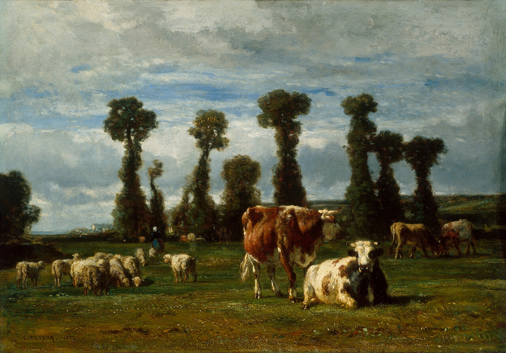
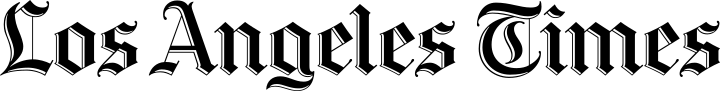
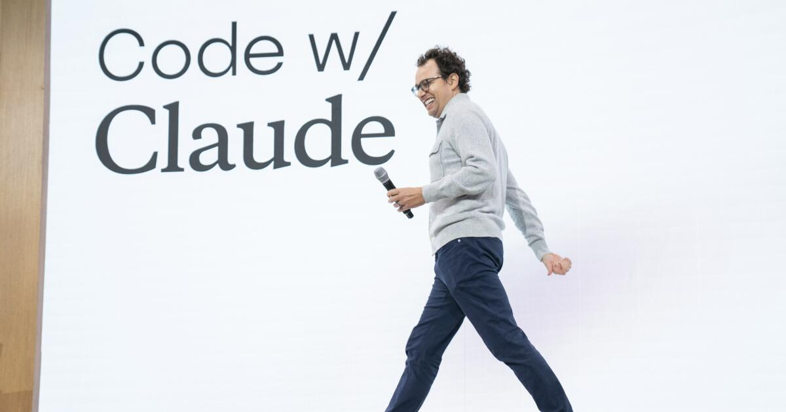
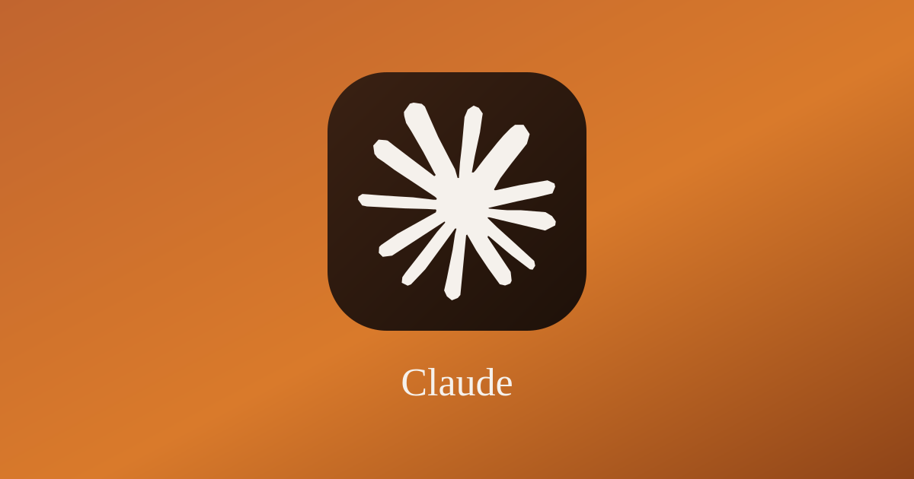

# Review Theories of Ethics {.title-slide data-menu-title="Week 4, Day 1"}

<!-- NOTICE:still in progress -->

CS 377, Week 4, Day 1 🟦 Racine 🟦

---

# Review Theories of Ethics {.title-slide .photo-title data-state="photo-title" background-image="../assets/blue-line-stops-better/stop10-racine-a.jpg" background-size="cover" data-menu-title="Week 4, Day 1"}

CS 377, Week 4, Day 1 🟦 Racine 🟦

<!-- image source: View of Blue Line station house, circa 1970. Image: CTA via jlkarch.com -->

---

## {.photo-only data-state="photo-only" background-image="../assets/blue-line-stops-better/stop10-racine-a.jpg" background-size="cover"}

---

## Map for Today

:::: columns
::: {.column width="55%"}
- Administrivia and questions
- Ethics in the News
- Book selection check-in
- Review ethical theories
- The button: Ostrom's design principles
- Preview feed exercise / media diary
:::

::: {.column width="40%"}

:::
::::

# Meet your TA {.title-slide .section-header}

---

## Invitation/reminder

Turn off phones, laptops, other distractions

---

## Ethics in the News {.news-cards}

::: {.source-top}
September 12, 2026: Anthropic CEO Dario Amodei calls on the AI industry to slow down, and rivals agree.
:::

:::: columns
::: {.column width="48%"}

Technology

<a href="https://www.washingtonpost.com/technology/2026/09/12/anthropic-ceo-dario-amodei-calls-ai-industry-slow-down/">Top AI leaders unite to warn the technology is advancing too fast</a>

Dario Amodei, Sam Altman and Elon Musk, long at odds with each other, found common ground in calling for a slowdown in AI amid mounting fears about its dangers.

Anthropic chief executive Dario Amodei speaks at the Moscone Center in San Francisco in 2025. (Chance Yeh/Getty Images)

By Ted Hesson, Ian Duncan and Gerrit De Vynck · September 12, 2026 · <a href="https://www.washingtonpost.com/technology/2026/09/12/anthropic-ceo-dario-amodei-calls-ai-industry-slow-down/">washingtonpost.com</a>

:::

::: {.column width="48%"}

Technology

<a href="https://www.politico.com/news/2026/09/12/anthropic-ceo-dario-amodei-seeks-immediate-slowdown-artificial-intelligence-01073519">AI leaders endorse slowdown in their risky technology</a>

Dario Amodei, who was the first to call for restraint on Saturday, warned that recent advances have begun to outpace the industry's ability to fully understand and control the technology.

Dario Amodei at the annual meeting of the World Economic Forum in Davos, Switzerland, Jan. 23, 2025. (AP Photo/Markus Schreiber, File)

By Ben Johansen and Owen Dahlkamp · September 12, 2026 · <a href="https://www.politico.com/news/2026/09/12/anthropic-ceo-dario-amodei-seeks-immediate-slowdown-artificial-intelligence-01073519">politico.com</a>

:::
::::

---

## "Why read a book?"

::: {.incremental}
- Reason #1: Feed and follow your curiosity
- Reason #2: Get used to self-directed learning
- Reason #3: Learn from human experts
- Reason #4: Escape in-depth
:::

---

## Table Discussion: Share your book selection! {.embed-slide}

::: {.embed-layout .golden-columns}
::: {.embed-copy}
- Which book did you choose? Who is the author?
- How did you find the book?
- How long is the book?
- What made you choose it?
- Have you started it? How do you like it so far?
:::

::: {.embed-frame}
<iframe
  src="../timer/index.html"
  title="CTA-style countdown timer"
  loading="lazy"
  data-external="1">
</iframe>
:::
:::

---

# Four Theories of Ethics {.title-slide .section-header}

---

## Four Theories / Approaches to Ethics {.theories-grid data-menu-title="Four Theories (emoji only)"}

<table>
<tr>
<td>
🏛
</td>
<td>
📖
</td>
</tr>
<tr>
<td>
📊
</td>
<td>
💟
</td>
</tr>
</table>

---

## Four Theories / Approaches to Ethics {.theories-grid .smaller data-menu-title="Four Theories (labeled)"}

<table>
<tr>
<td>
🏛

Virtue Ethics
</td>
<td>
📖

Deontological
</td>
</tr>
<tr>
<td>
📊

Utilitarian
</td>
<td>
💟

Care Ethics
</td>
</tr>
</table>

---

## Review: The Deontic Square {.figure-slide}

::: {.source-top}
[SEP, *Deontological Ethics*](https://plato.stanford.edu/entries/ethics-deontological/)
:::

::: {.figure-caption}
The deontic square: every act is **obligatory**, **permitted**, **omissible**, or **prohibited**. Source: [Wikipedia, "Deontic square"](https://en.wikipedia.org/wiki/File:Deontic_square.svg)
:::

---

## Connect the dots… {.smaller}

- William David Ross contended there are seven duties that determine what is right:

| Duty | Description |
|---|---|
| Fidelity | Keep promises and tell the truth |
| Reparation | Make amends for wrongful acts |
| Gratitude | Return kindness to those who give |
| Non-injury | Do not hurt others |
| Beneficence | Promote the aggregate good |
| Self-improvement | Improve your own condition |
| Justice | Distribute benefits and burdens equitably |

---

## Different Flavors of Each Theory

:::: columns
::: {.column width="48%" .fragment}
### 📖 Deontological

- Agent-centered, patient-centered
- Act deontology, rule deontology
- Duty-based, rights-based
- Divine command
- Monistic, pluralistic
- Perfect duties, imperfect duties
- Source: [SEP, *Deontological Ethics*, §2](https://plato.stanford.edu/entries/ethics-deontological/#DeoThe)
:::

::: {.column width="48%" .fragment}
### 📊 Utilitarian

- Act utilitarian, rule utilitarian
- Hedonistic, preference, or objectivist
- Maximizing, satisficing, or scalar
- Objective, expectational
- "Negative utilitarianism" (harm reduction)
- Source: [SEP, *Consequentialism*, §§2–6](https://plato.stanford.edu/entries/consequentialism/#WhatCons) (sorts the by *what* is good, *which* consequences count, and *for whom*)
:::
::::

---

## Different Flavors of Each Theory

:::: columns
::: {.column width="48%" .fragment}
### 🏛 Virtue Ethics

- Agent-based (focus on traits)
- Exemplarist (focus on saints, heroes, etc.)
- Perfectionistic, target-centered
- Care-based virtue ethics
- Universal, cross-cultural, or relativistic
- Source: [SEP, *Virtue Ethics*, §2 "Forms of Virtue Ethics"](https://plato.stanford.edu/entries/ethics-virtue/#FormVirtEthi)
:::

::: {.column width="48%" .fragment}
### 💟 Care Ethics

- Psychological or philosophical
- Maternal, political, global
- Micro-relational, institutional, structural (scales)
- Relational or principled (i.e. "individualistic")
- Source: [IEP, *Care Ethics*](https://iep.utm.edu/care-ethics/) (sections on maternalism, political theory, international relations, applications, etc.)
:::
::::

---

## More than Four

- **Communitarianism**: common good, social lives
- **Responsibility ethics**: individual accountability
- **The "capability approach"**: opportunities for achieving practical values (e.g. health)
- Others you know of?
- Other questions?

---

## All at Once {.embed-slide}

::: {.source-top}
Caleb Williams responds to an ethics question.
:::

:::: {.embed-layout .embed-full}
::: {.embed-frame style="width:100%;height:100%;margin:0;"}
<iframe
  src="https://www.youtube-nocookie.com/embed/iM3Bu_S82Jc?start= 6491"
  title="Caleb Williams responds to a trolley problem (Pardon My Take)"
  loading="lazy"
  allow="accelerometer; clipboard-write; encrypted-media; gyroscope; picture-in-picture"
  allowfullscreen
  style="width:100%;height:100%;border:none;display:block;"
  data-external="1">
</iframe>
:::

::: {.embed-overlay}
[Open in new tab](https://www.youtube-nocookie.com/embed/iM3Bu_S82Jc?start= 6491)
:::
::::

---

# The Button {.title-slide .section-header}

---

## Where we left the button {.smaller}

::: {.source-top}
[doethics.fun/dilemmas/utilitarian-button-matrix](https://doethics.fun/dilemmas/utilitarian-button-matrix/)
:::

- Two sections, 1% of the final grade, one button each
- payoff table
- Today: breaking down the "tragedy of the commons," free riders

---

## Elinor Ostrom (1933–2012) {.smaller}

:::: columns
::: {.column width="55%"}
- Political economist; Nobel Prize in Economics, 2009
- Studied irrigation systems, fisheries, forests, grazing land ("real commons")
- Found groups that governed shared resources for centuries **without** privatizing or nationalizing
- "what rules let a group stop each other from defecting?"
  - (as opposed to "will people defect?")
:::

::: {.column .portrait-solo width="40%"}

::: {.caption}
Elinor Ostrom, Stockholm, December 2009. Photo: [Holger Motzkau](https://commons.wikimedia.org/wiki/File:Elinor_Ostrom_close-up_(cropped).jpg), CC BY-SA 3.0
:::
:::
::::

---

## The Tragedy of the Commons (Hardin, 1968) {.smaller}

:::: columns
::: {.column width="52%"}
- Shared pasture, private herds
- Each herder gains from one more cow
- Shared cost of overgrazing
- Hardin: "only private property or coercion can save the commons"
- Ostrom: "communities govern themselves all the time!"
:::

::: {.column width="44%"}

::: {.caption}
Constant Troyon, *Pasture in Normandy*, 1852, oil on panel. [Art Institute of Chicago](https://www.artic.edu/artworks/897), Henry Field Memorial Collection. Public domain (CC0)
:::
:::
::::

<!-- TODO: decide how much Hardin to include; note his later eugenics writing -->

---

## Ostrom's Design Principles {.smaller}

::: {.incremental}
1. **Clearly defined boundaries**: who is in? What is the resource?
2. **Congruence**: rules fit local conditions, costs proportional to benefits
3. **Collective-choice arrangements**: people bound by the rules can change the rules
4. **Monitoring**: by the members themselves, and/or by outside monitors
5. **Graduated sanctions**: a first violation is not as bad as a second, third, etc.
6. **Conflict-resolution mechanisms**
7. **Minimal recognition of the right to organize**: outside authorities do not override the group
8. **Nested enterprises**: moreso for large systems, governance in layers
:::

---

## Table Discussion (5 min): What will your section choose? {.embed-slide}

::: {.embed-layout .golden-columns}
::: {.embed-frame}
<iframe
  src="https://doethics.fun/dilemmas/utilitarian-button-matrix/"
  title="Dilemma: The Utilitarian Button"
  loading="lazy"
  data-external="1">
</iframe>
:::

::: {.embed-frame}
<iframe
  src="../timer/index.html"
  title="CTA-style countdown timer"
  loading="lazy"
  data-external="1">
</iframe>
:::

::: {.embed-overlay}
[Open in new tab](https://doethics.fun/dilemmas/utilitarian-button-matrix/)
:::
:::

---

## What was changed {.smaller}

::: {.incremental}
- **Timing (#1):** "during any class meeting": push after everyone left still counted.
  - Now: while class is in session, from the start of the period until "see you next class"
- **Monitoring (#4):** a push now requires at least 8 *other* enrolled students present, in person, able to see it
- **Monitoring (#4):** the instructor tells a section when its own button has been pushed

:::

---

## The rules now read {.smaller}

::: {.source-top}
[doethics.fun/dilemmas/utilitarian-button-matrix](https://doethics.fun/dilemmas/utilitarian-button-matrix/)
:::

**A push counts only if** an enrolled student pushes the button:

- **in person**, and
- **while class is in session**: from the start of the scheduled period until the instructor says "see you next class", and
- with **at least 8 other enrolled students** present and able to see it

A push that misses any of these does not count.

**The instructor will** tell a section when its own button has been pushed, and share any letter of intent to refrain with both sections — but still will neither confirm nor deny whether the *other* section has pushed.

Everything else is unchanged: two pushes per section, the two letters, five minutes on request, final December 2.

---

# Media Diary Exercise {.title-slide .section-header}

---

## Food in your Feed (Media Diary) {.embed-slide .smaller}

:::: {.embed-layout}
::: {.embed-copy}
Due tomorrow night at 11:59pm

- Intended to be fun/informative/enjoyable!
- 20 data points and a few reflective questions
- Use the table (Account Name, Account Type, Ad?, # of Likes, Notes) for 20 posts from a feed of your choice (Instagram, TikTok, X, YouTube, etc.)
- Submit a PDF or a link to an online document (Google doc, GitHub repository)
- Will be our launching point for discussion on Wednesday
:::

::: {.embed-frame style="width:100%;height:100%;margin:0;"}
<iframe
  src="https://doethics.fun/exercises/food-in-your-feed"
  title="Food in your Feed exercise"
  loading="lazy"
  style="width:100%;height:100%;border:none;display:block;"
  data-external="1">
</iframe>
:::

::: {.embed-overlay}
[Open in new tab](https://doethics.fun/exercises/food-in-your-feed)
:::
::::

---

## That's all for today! See you Wednesday!

---

# Ethical Issues in Algorithmic Feeds {.title-slide data-menu-title="Week 4, Day 2"}

CS 377, Week 4, Day 2 🟦 UIC-Halsted 🟦

---

# Ethical Issues in Algorithmic Feeds {.title-slide .photo-title data-state="photo-title" background-image="../assets/blue-line-stops/stop11-uic-halsted-a.jpg" background-size="cover" data-menu-title="Week 4, Day 2"}

CS 377, Week 4, Day 2 🟦 UIC-Halsted 🟦

---

## {.photo-only data-state="photo-only" background-image="../assets/blue-line-stops/stop11-uic-halsted-a.jpg" background-size="cover"}

---

## Ethics in the News {.news-cards}

::: {.source-top}
September 11, 2026: Anthropic reports that a cell in northern Yemen used its Claude models to develop missile-guidance software — and that the company's own threat-intelligence team detected and shut it down.
:::

:::: columns
::: {.column width="48%"}

Business

<a href="https://www.latimes.com/business/story/2026-09-11/anthropic-says-yemeni-weapons-cell-used-its-ai-to-try-to-build-missile-guidance-software">Anthropic says Yemeni weapons cell used its AI to try to build missile guidance software</a>

The Yemen-based group used Claude to help develop guidance, navigation and control software, effectively replacing some tasks typically performed by software engineers.

Anthropic CEO Dario Amodei at the Code with Claude conference. (Don Feria / AP Content Services for Anthropic)

By Loni Prinsloo and Omar El Chmouri · September 11, 2026 · <a href="https://www.latimes.com/business/story/2026-09-11/anthropic-says-yemeni-weapons-cell-used-its-ai-to-try-to-build-missile-guidance-software">latimes.com</a>

:::

::: {.column width="48%"}

Technology

<a href="https://www.bloomberg.com/news/articles/2026-09-11/anthropic-says-yemeni-group-used-claude-in-missile-development">Anthropic Says Yemeni Cell Used Claude in Missile Development</a>

The actors were working on three weapons projects, including a guided rocket, a ballistic missile with a claimed range of more than 2,000 kilometers, and a missile family known as the R2000.

The Claude app icon. (Anthropic / Wikimedia Commons, CC0)

By Loni Prinsloo and Omar El Chmouri · September 11, 2026 · <a href="https://www.bloomberg.com/news/articles/2026-09-11/anthropic-says-yemeni-group-used-claude-in-missile-development">bloomberg.com</a>

:::
::::

---

## Administrivia

:::: columns
::: {.column width="55%"}
- Canvas updates and upcoming deadlines
- Questions from last class?
- Reminders
:::

::: {.column width="40%"}

:::
::::

---

## Agenda for Today

:::: columns
::: {.column width="55%"}
- Ethics in the News
- Activity: samples from your feeds
- Feed algorithms 101
- Activity: ranking
- Mini-lecture: Values and Ethics in Ranking
- Mini-lecture: Content moderation
:::

::: {.column width="40%"}

:::
::::

---

## 🔀 Seat Shuffle

<!-- image: room diagram — lectern "0", tables 1–8, projector screens, door -->
- TODO: add image — *room diagram — lectern "0", tables 1–8, projector screens, door*

---

## Review Question

"What is morally right is whatever aligns with the law."

- [A] Virtue ethics
- [B] Utilitarian ethics
- [C] Care ethics
- [D] Deontological ethics
- [E] Polymorphic ethics

---

## Review Question

"How can we best meet one another's needs?"

- [A] Virtue ethics
- [B] Utilitarian ethics
- [C] Care ethics
- [D] Deontological ethics
- [E] Encapsulated ethics

---

## Review Question

"Doing the right thing often involves a golden mean between deficiency and excess of a given trait."

- [A] Virtue ethics
- [B] Utilitarian ethics
- [C] Care ethics
- [D] Deontological ethics
- [E] Recursive ethics

---

## Review Question

"We must do the most good for the most people."

- [A] Virtue ethics
- [B] Utilitarian ethics
- [C] Care ethics
- [D] Deontological ethics
- [E] Von Neumann ethics

---

## Review Question

Which theory do you feel most aligned with so far?

- [A] Virtue ethics
- [B] Utilitarian ethics
- [C] Care ethics
- [D] Deontological ethics
- [E] Nihilism

---

## Table Discussion: Your Feed Sample (8 min)

- Which app did you use? When did you check it?
- What would you remove, if you had to choose?
- How would you rate this feed sample overall?
- What did *not* show up in your feed?
- Did this sample seem typical?
- What else surprised you or stuck out to you?

---

# Feed Algorithms {.title-slide .section-header}

---

## Feed Algorithms 101

---

## Facebook's Feed System (2021)

<!-- image: Facebook's feed system architecture diagram (2021) -->
- TODO: add image — *Facebook's feed system architecture diagram (2021)*

---

## Generic Feed System Architecture {.smaller}

A typical recommender system proceeds in four stages:

::: {.incremental}
1. **Moderation** — remove items that violate platform policies
2. **Candidate generation** — select high-potential items from a large pool (billions → thousands)
3. **Ranking** — assign each candidate a numeric score for this user and context
4. **Re-ranking** — reorder by ancillary goals (variety, freshness, safety)
:::

<!-- image: pipeline diagram showing item counts at each stage (Georgetown/KGI, Recommender Systems 101, March 2025) -->
- TODO: add image — *pipeline diagram showing item counts at each stage (Georgetown/KGI, Recommender Systems 101, March 2025)*

---

## Generic Feed System Architecture

<!-- image: same diagram with annotation showing approximate item counts at each stage for a large platform -->
- TODO: add image — *same diagram with annotation showing approximate item counts at each stage for a large platform*

---

# Values in Ranking {.title-slide .section-header}

---

## Mini-lecture: Values and Ethics in Ranking

---

## News Values

- What goes on the "front page?"
- What makes an event important?
- Original study by Johan Galtung and Mari Holmboe Ruge (1965)
  - "Elite" people and places
  - Conflicts / scandals / disasters
- Follow-up by Tony Harcup and Deirdre O'Neill (2017)

---

## News Values (Harcup and O'Neill, 2017) {.smaller}

:::: columns
::: {.column width="48%"}
- Threshold/intensity
- Meaningfulness
- Clarity/unambiguity
- Consonance
- Composition
- Elite nations, people
- Negativity (conflict, disaster)
:::

::: {.column width="48%"}
- Surprise
- Bad news (death, injury)
- Shareability
- Show business, sport, humor
- Follow-up stories
- Drama (searches, rescues, etc.)
- Local relevance to audience
- Magnitude of impact
:::
::::

---

## Ranking Exercise

- See handout
- Items you want seen by more people should be ranked higher (1 = top item)

---

## How did you decide the ranking?

---

## "Can't you just score the posts?"

- Current options on Reddit:
  - Best, Hot, New, Top, Trending
- Ranking algorithms are opinions embedded in code
  - See Evan Miller, "How Not To Sort By Average Rating"

---

## Algorithms are opinions {.quote-slide}

> Algorithms are opinions embedded in code…. They think algorithms are objective and true and scientific — that's a marketing trick.
>
> — Cathy O'Neil

---

## Crappy Ranking Options

- Score = (Positive ratings) − (Negative ratings)
  - Used by Urban Dictionary
- Score = Upvote Percentage
  - (Positive ratings) / (Total ratings)
  - Can be skewed with a small number of observations
  - Used by Amazon

---

## Improved Ranking

- Your ideas?

::: {.fragment}
- Technical fix: binomial proportion confidence interval
- Reddit hides the number of upvotes for the first few hours
:::

---

## How Facebook ranks comments

<!-- image: via "Representative Ranking for Deliberation in the Public Sphere" (2025) -->
- TODO: add image — *via "Representative Ranking for Deliberation in the Public Sphere" (2025)*

---

## Instagram Notifications (Example of a "Tweak")

- Author diversity

<!-- image: via "A New Ranking Framework for Better Notification Quality on Instagram" (2025) -->
- TODO: add image — *via "A New Ranking Framework for Better Notification Quality on Instagram" (2025)*

---

## Which ethical frameworks are at play? How? {.theories-grid .smaller}

<table>
<tr>
<td>
🏛

Virtue Ethics
</td>
<td>
📖

Deontological
</td>
</tr>
<tr>
<td>
📊

Utilitarian
</td>
<td>
💟

Care Ethics
</td>
</tr>
</table>

---

# Previewing Content Moderation {.title-slide .section-header}

---

## What Is Content Moderation?

- The practice of monitoring and applying rules to user-generated content
- Decisions about what to allow, remove, label, or reduce in reach
- Carried out by humans, automated systems, or both
- Much more on this next class!

---

## Gazing into feeds {.quote-slide}

> He who fights with monsters should look to it that he himself does not become a monster. And if you gaze long into an abyss, the abyss also gazes into you.
>
> — Friedrich Nietzsche

---

## That's all for today!

See you next week!

---

# References & Credits {.sources}

1. GitHub source: <https://github.com/jackbandy/ethical-issues-in-computing-uic/blob/main/docs/slides/week4.md>.
2. Day 1 title photo: [Racine CTA](https://commons.wikimedia.org/wiki/File:Racine_CTA_080216.jpg) by JeremyA, via Wikimedia Commons, CC BY-SA 3.0.
3. Georgetown/KGI, *Recommender Systems 101* (March 2025). Pipeline architecture diagram.
4. Johan Galtung and Mari Holmboe Ruge, "The Structure of Foreign News" (1965); Tony Harcup and Deirdre O'Neill, "What is News? News values revisited (again)" (2017).
5. Evan Miller, ["How Not To Sort By Average Rating"](https://www.evanmiller.org/how-not-to-sort-by-average-rating.html).
6. Cathy O'Neil, *Weapons of Math Destruction* (2016).
7. Nick Hopkins, ["Facebook's internal rulebook on sex, terrorism and violence"](https://www.theguardian.com/news/2017/may/21/revealed-facebook-internal-rulebook-sex-terrorism-violence), *The Guardian* (2017).
8. UChicago, [Online Content Moderation Policies from 43 Platforms](https://ocmp43.cs.uchicago.edu).
9. Schaffner et al., ["Community Guidelines Make this the Best Party on the Internet"](https://doi.org/10.1145/3613904.3642333), *CHI 2024*.
10. Elinor Ostrom, *Governing the Commons: The Evolution of Institutions for Collective Action* (Cambridge University Press, 1990), [doi:10.1017/CBO9780511807763](https://doi.org/10.1017/CBO9780511807763) — the eight design principles.
11. Garrett Hardin, ["The Tragedy of the Commons"](https://doi.org/10.1126/science.162.3859.1243), *Science* 162, no. 3859 (1968): 1243–1248.
12. Elinor Ostrom portrait: [Holger Motzkau](https://commons.wikimedia.org/wiki/File:Elinor_Ostrom_close-up_(cropped).jpg), Nobel press conference, Stockholm, 2009, via Wikimedia Commons, CC BY-SA 3.0.
13. *Pasture in Normandy* (1852) by Constant Troyon, oil on panel, [Art Institute of Chicago](https://www.artic.edu/artworks/897), Henry Field Memorial Collection, public domain (CC0).
14. Theory variants: [*Deontological Ethics*](https://plato.stanford.edu/entries/ethics-deontological/), [*Consequentialism*](https://plato.stanford.edu/entries/consequentialism/), and [*Virtue Ethics*](https://plato.stanford.edu/entries/ethics-virtue/), *Stanford Encyclopedia of Philosophy*; [*Care Ethics*](https://iep.utm.edu/care-ethics/), *Internet Encyclopedia of Philosophy*.
15. [Caleb Williams on *Pardon My Take*](https://www.youtube.com/watch?v=iM3Bu_S82Jc) (Barstool Sports).
16. Ethics in the news: Ted Hesson, Ian Duncan, and Gerrit De Vynck, ["Top AI leaders unite to warn the technology is advancing too fast"](https://www.washingtonpost.com/technology/2026/09/12/anthropic-ceo-dario-amodei-calls-ai-industry-slow-down/), *The Washington Post* (September 12, 2026), lead photo by Chance Yeh/Getty Images; Ben Johansen and Owen Dahlkamp, ["AI leaders endorse slowdown in their risky technology"](https://www.politico.com/news/2026/09/12/anthropic-ceo-dario-amodei-seeks-immediate-slowdown-artificial-intelligence-01073519), *Politico* (September 12, 2026), lead photo by Markus Schreiber/AP. Both cards are facsimiles built from each story's own headline, deck, photo, and byline — not captures of the publications' page designs. The essay both stories cover: Dario Amodei, ["We Must Pace the Frontier"](https://darioamodei.com/post/we-must-pace-the-frontier).
17. Slide deck built with [Quarto](https://quarto.org/) and Reveal.js.
