# Content Moderation and Intro to Stories {.title-slide data-menu-title="Week 5, Day 1"}

CS 377, Week 5, Day 1 🟦 Clinton 🟦

---

# Content Moderation, Intro to Stories {.title-slide .photo-title data-state="photo-title" background-image="../assets/blue-line-stops-better/stop12-clinton-old-post-office.jpg" background-size="cover" data-menu-title="Week 5, Day 1"}

CS 377, Week 5, Day 1 🟦 Clinton 🟦

<!-- image source: Clinton station, via Jim Parker on Flickr -->

---

## {.photo-only data-state="photo-only" background-image="../assets/blue-line-stops-better/stop12-clinton-old-post-office.jpg" background-size="cover"}

---

## Agenda for Today

:::: columns
::: {.column width="55%"}
- Ethics in the news
- Shuffle seats
- Warm-up: book check-in
- Mini-lecture: content moderation
- Moderation case studies
- Discuss "Omelas" (Le Guin)
- Preview "Here and Now" + exercise
:::

::: {.column width="40%"}

:::
::::

---

## (DeWitt) Clinton Connection

:::: columns
::: {.column width="40%"}
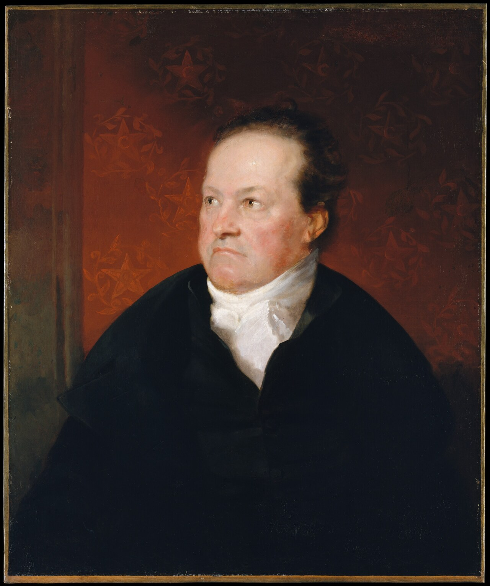

::: {.caption}
Samuel F. B. Morse, *DeWitt Clinton*, c. 1826. [Metropolitan Museum of Art via Wikimedia Commons](https://commons.wikimedia.org/wiki/File:De_Witt_Clinton_MET_DT2056.jpg), public domain (CC0)
:::
:::

::: {.column width="56%"}
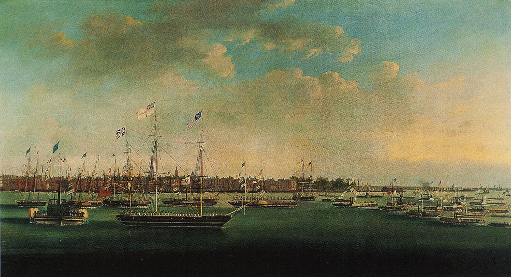

::: {.caption}
Anthony Imbert, *Grand Canal Celebration*, New York, 1825. [Wikimedia Commons](https://commons.wikimedia.org/wiki/File:New_York_celebration_for_the_Erie_Canal_1825.png), public domain
:::
:::
::::

---

## Ethics in the News {.news-cards}

::: {.source-top}
September 21, 2026: two of the day's AI stories — a payout for a feature that shipped late, and an argument about how dangerous the technology is.
:::

:::: columns
::: {.column width="48%"}

Technology

<a href="https://www.axios.com/2026/09/21/apple-iphone-siri-ai-settlement-paid-eligibility">Here's how iPhone users can get up to $95 from Apple's AI delay</a>

Apple customers can now file claims in a massive class-action settlement over Siri's delayed AI rollout. The deadline to file is Dec. 21, 2026.

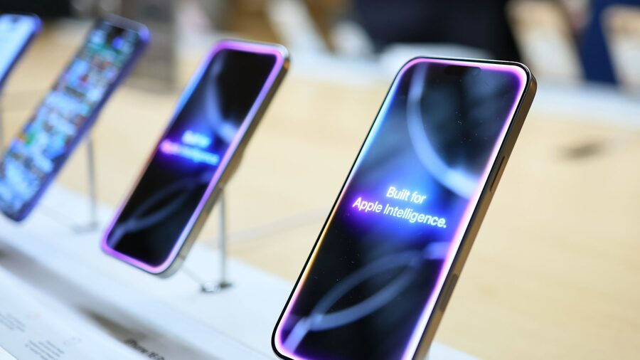

Apple iPhone 16 models are displayed at an Apple store in New York on April 4, 2025. (Michael M. Santiago/Getty Images)

By Herb Scribner · September 21, 2026 · <a href="https://www.axios.com/2026/09/21/apple-iphone-siri-ai-settlement-paid-eligibility">axios.com</a>

:::

::: {.column width="48%"}

Artificial intelligence

<a href="https://www.theguardian.com/technology/2026/sep/21/nvidia-boss-jensen-huang-dismisses-warnings-ai-destroys-world-anthropic">Nvidia boss says there is '0% chance' AI destroys the world by 2030</a>

Jensen Huang dismisses warnings from former Anthropic researcher and others as "doomsday narratives."

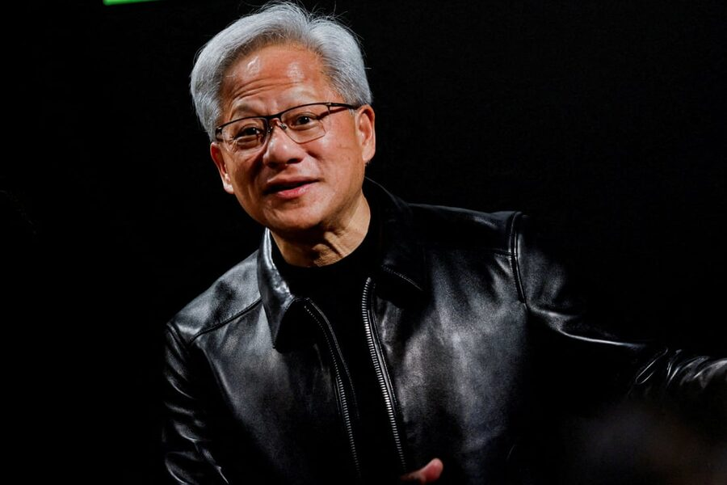

Nvidia's Jensen Huang said predictions of an extinction-level event caused by AI were "not grounded in science." (Manami Yamada/Reuters)

By Mark Sweney and Robert Booth · September 21, 2026 · <a href="https://www.theguardian.com/technology/2026/sep/21/nvidia-boss-jensen-huang-dismisses-warnings-ai-destroys-world-anthropic">theguardian.com</a>

:::
::::

---

## 🔀 Seat Shuffle {.embed-slide}

::: {.embed-layout}
::: {.embed-copy}
- Shuffle seats!
- Enter a seed and shuffle

[Open in a new tab](https://doethics.fun/in-progress/visual-seat-shuffle.html)
:::

::: {.embed-frame style="position:absolute;top:0;right:0;bottom:52px;width:38%;margin:0;border-radius:0 6px 6px 0;border:2px solid #d8d8d8;"}
<iframe
  src="../in-progress/visual-seat-shuffle.html"
  title="Visual Seat Shuffle"
  data-external="1">
</iframe>
:::
:::

---

## Table Discussion: Book Check-in {.embed-slide}

::: {.embed-layout .golden-columns}
::: {.embed-copy}
- How is your book coming along?
- How much have you read?
- What have you learned so far?
- How long do you think it will take to complete?
- What's your plan to read the rest?
- Presentation ideas?
:::

::: {.embed-frame}
<iframe
  src="../timer/index.html"
  title="CTA-style countdown timer"
  loading="lazy"
  data-external="1">
</iframe>
:::
:::

---

# Mini-lecture: Content Moderation {.title-slide .section-header}

---

## Generic Feed System Architecture (Recap)

::: {.source-top}
[Knight-Georgetown Institute, *Recommender Systems 101* (March 2025)](https://kgi.georgetown.edu/wp-content/uploads/2025/02/Recommender-Systems-101.pdf)
:::

:::: columns
::: {.column width="34%"}
1. **Moderation**
2. **Candidate generation**
3. **Ranking**
4. **Re-ranking**
:::

::: {.column width="62%"}
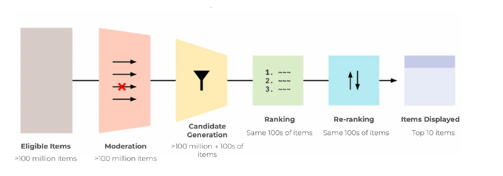
:::
::::

---

## Free Speech

:::: columns
::: {.column width="60%"}
- **[First Amendment](https://constitution.congress.gov/constitution/amendment-1/):** "Congress shall make no law…abridging the freedom of speech, or of the press"
- **[Section 230](https://www.law.cornell.edu/uscode/text/47/230) (Communications Decency Act):** "It is the policy of the United States… to encourage the development of technologies which maximize user control over what information is received by individuals…who use the Internet…"
:::

::: {.column width="37%"}
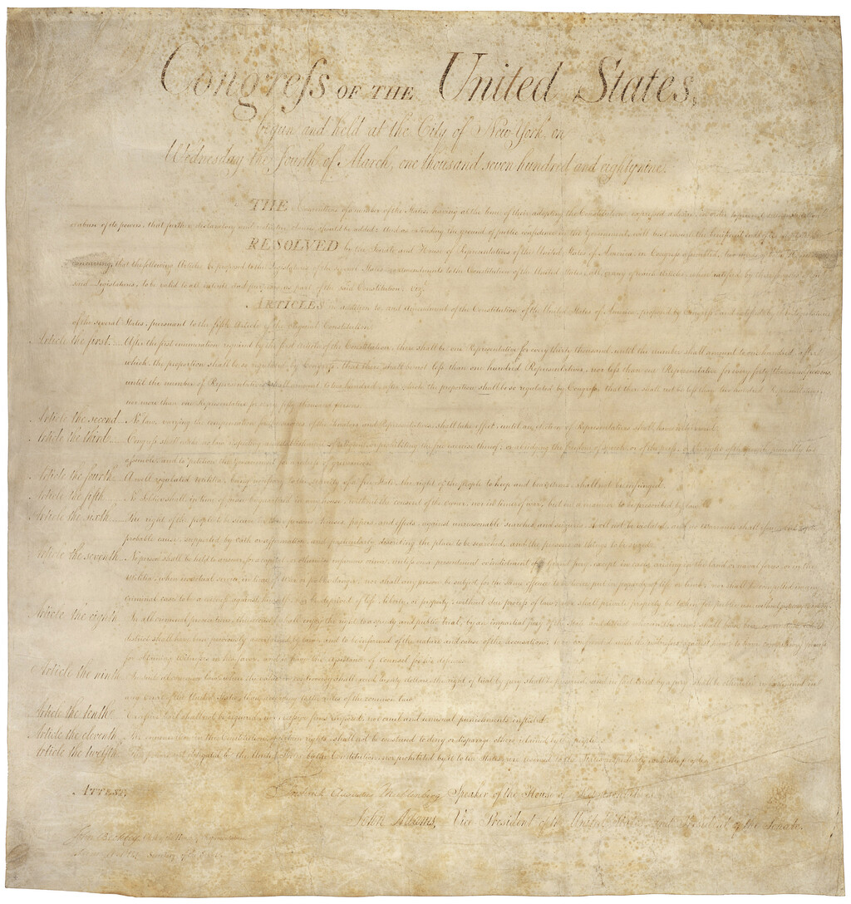

::: {.caption}
The engrossed Bill of Rights, 1789 — the First Amendment is the third article listed. [World Digital Library via Wikimedia Commons](https://commons.wikimedia.org/wiki/File:Bill_of_Rights_WDL2704.png), public domain
:::
:::
::::

---

## Custodians of the Internet

:::: columns
::: {.column width="58%"}
- Tarleton Gillespie, Microsoft Research
- Moderation usually looks **peripheral** ("a custodial task, like turning the lights on and off and sweeping the floors")
- What if it is **central** to what a platform is?
:::

::: {.column width="38%"}
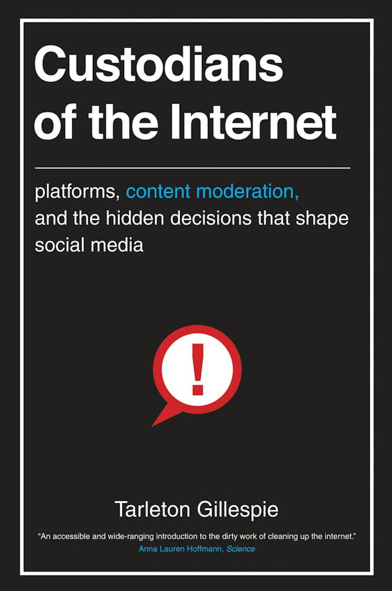

::: {.caption}
*Custodians of the Internet*, [Yale University Press](https://yalebooks.yale.edu/book/9780300261431/custodians-of-the-internet/), 2018 ; [full PDF](https://tarletongillespie.org/Gillespie_CUSTODIANS_print.pdf) from the author, [CC BY-NC-SA 4.0](https://creativecommons.org/licenses/by-nc-sa/4.0/)
:::
:::
::::

---

## Moderation as the Product {.quote-slide}

> "Moderation is, in many ways, the commodity that platforms offer."
>
> — Tarleton Gillespie, *Custodians of the Internet* (2018), p. 13

---

## Moderation at Scale: Meta

:::: columns
::: {.column width="50%"}
- ~15,000 content moderators
- ~1 moderator per **330,000** users
- ~40,000 in trust and safety

::: {.figure-caption}
Moderator count via *The New York Times*; 40,000 figure from Meta's testimony at the [Senate Judiciary hearing](https://www.judiciary.senate.gov/committee-activity/hearings/big-tech-and-the-online-child-sexual-exploitation-crisis) (January 2024). See [Meta Community Standards Enforcement Report](https://transparency.meta.com/reports/community-standards-enforcement/)
:::
:::

::: {.column width="46%"}
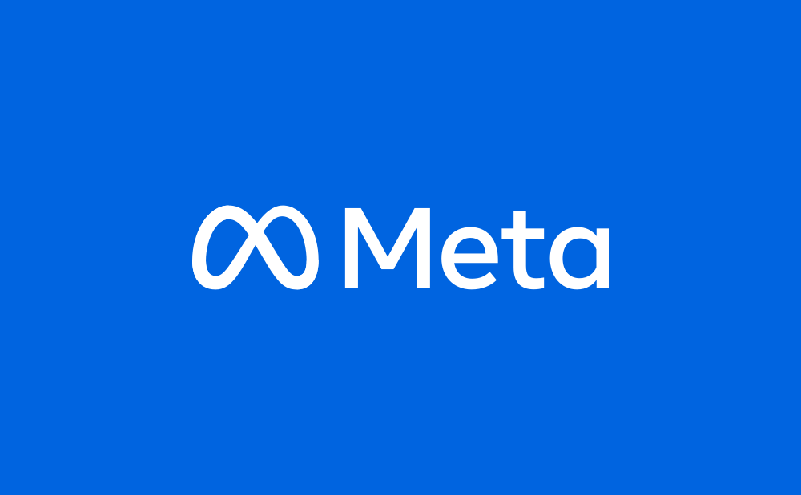{alt="Meta logo"}
:::
::::

---

## Moderation at Scale: TikTok

:::: columns
::: {.column width="50%"}
- Claims **40,000** workers in global trust and safety
- Stated focus on "minor safety"
- ~81% of removals automated

::: {.figure-caption}
Source: [TikTok Community Guidelines Enforcement Report, Q4 2024](https://www.tiktok.com/transparency/en/community-guidelines-enforcement-2024-4/)
:::
:::

::: {.column width="46%"}
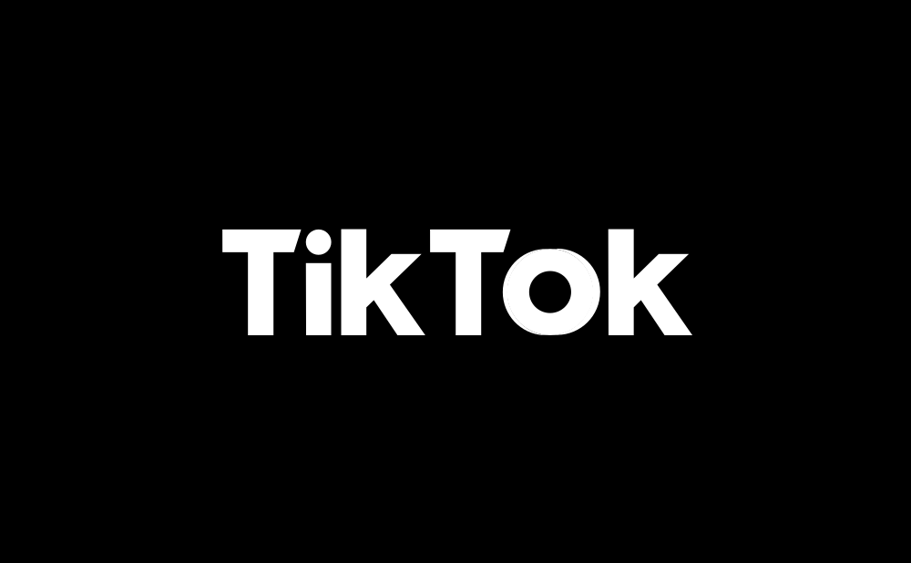{alt="TikTok logo"}
:::
::::

---

## Moderation at Scale: YouTube

:::: columns
::: {.column width="50%"}
- Estimated 7,000–10,000 moderators
- **9.5 million** videos removed in Q4 2024
- **842.8 million** comments removed

::: {.figure-caption}
Removal counts: [Google Transparency Report: YouTube Community Guidelines enforcement](https://transparencyreport.google.com/youtube-policy/removals). Moderator count is an outside estimate.
:::
:::

::: {.column width="46%"}
{alt="YouTube logo"}
:::
::::

---

# Moderation Case Studies {.title-slide .section-header}

---

## Content Notice

::: {}
- The next slide shows a graphic image of war violence, including injured children.
- A later slide reproduces a leaked Facebook training slide with some misogynistic and violent language.
- They are cases that forced platforms to rewrite their rules.
:::

---

## Example: "The Terror of War" (1972) {.figure-slide .framed-figure}

::: {.source-top}
[Espen Egil Hansen, "Dear Mark…", *Aftenposten* (September 8, 2016)](https://www.aftenposten.no/meninger/kommentar/i/G892Q/dear-mark-i-am-writing-this-to-inform-you-that-i-shall-not-comply-with-your-requirement-to-remove-this-picture)
:::

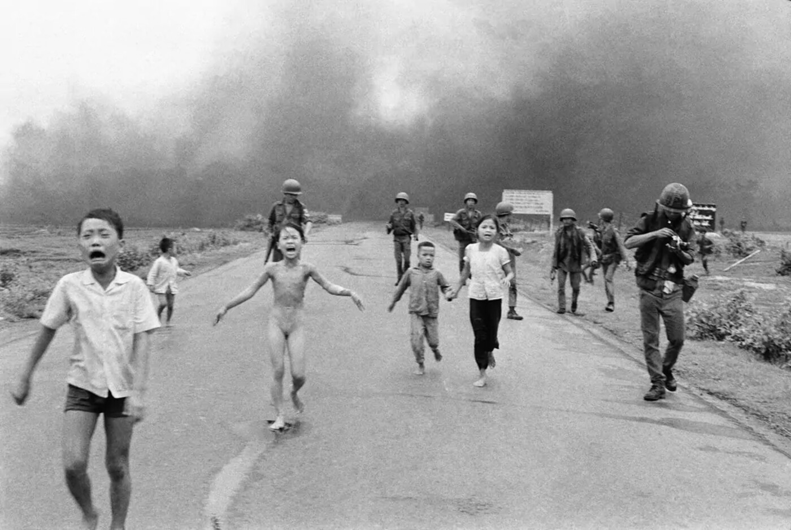{style="max-height:470px;"}

::: {.figure-caption}
Vietnam, 8 June 1972. Facebook removed the photo in 2016 as child nudity, then reversed (see open letter from the editor of Norway's largest newspaper). Long credited to Nick Ut/AP; [authorship under review by World Press Photo](https://www.worldpressphoto.org/news/2025/authorship-attribution-suspended-for-the-terror-of-war). [Wikimedia Commons](https://commons.wikimedia.org/wiki/File:The_Terror_of_War.png), public domain
:::

---

## Example: The Terror of War {.quote-slide}

> "Napalm is very powerful, but faith, forgiveness, and love are much more powerful.
> We would not have war at all if everyone could learn how to live with true love,
> hope, and forgiveness."
>
> — Phan Thi Kim Phuc, NPR interview (2008)

---

## Example: "Credible Violence" {.figure-slide .framed-figure}

::: {.source-top}
[Violence and Incitement — Meta Transparency Center](https://transparency.meta.com/policies/community-standards/violence-incitement/)
:::

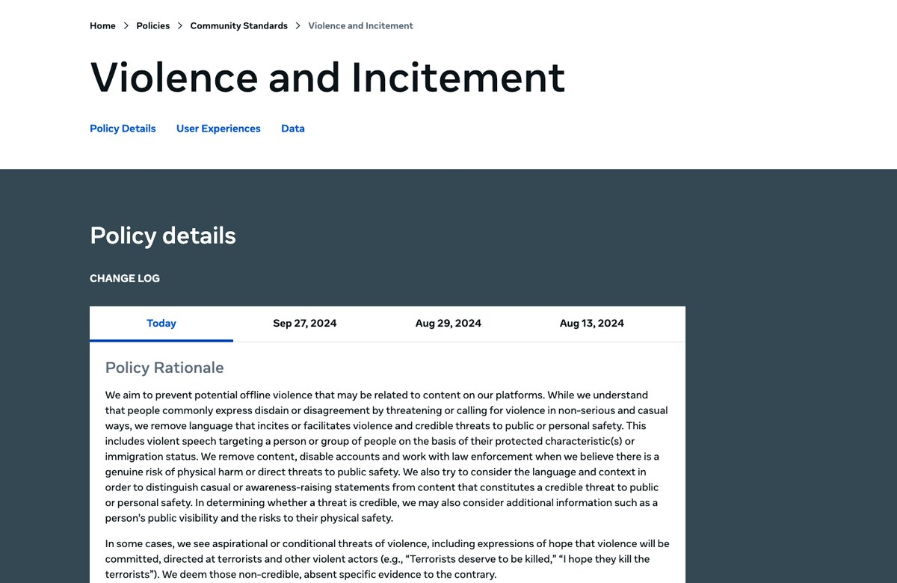{style="max-height:470px;"}

::: {.figure-caption}
Meta's current public rule, successor to the internal "credible violence" rulebook leaked to Nick Hopkins, ["Facebook's internal rulebook on sex, terrorism and violence,"](https://www.theguardian.com/news/2017/may/21/revealed-facebook-internal-rulebook-sex-terrorism-violence) *The Guardian* (2017).
:::

---

## Example: The Leaked Rulebook (2017) {.figure-slide .framed-figure}

::: {.source-top}
[Nick Hopkins, "Revealed: Facebook's internal rulebook on sex, terrorism and violence," *The Guardian* (May 21, 2017)](https://www.theguardian.com/news/2017/may/21/revealed-facebook-internal-rulebook-sex-terrorism-violence)
:::

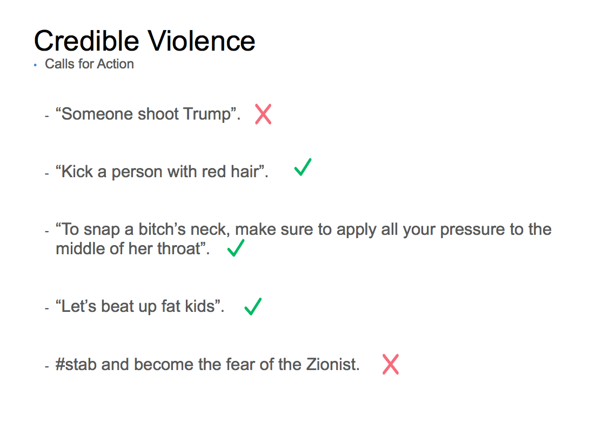{style="max-height:440px;" alt="A Facebook moderator training slide headed \"Credible Violence: Calls for Action,\" listing five example posts, each marked with a green tick to keep it up or a red cross to delete it"}

::: {.figure-caption}
"Facebook's policy on threats of violence. A green check means something can stay on the site; a red cross means it should be deleted." See *The Guardian* in 2017, the start of Meta's public [Violence and Incitement](https://transparency.meta.com/policies/community-standards/violence-incitement/) policy.
:::

---

## Ethical Questions in Content Moderation

:::: columns
::: {.column width="48%"}
**Design questions**

- Who writes the rules?
- How are edge cases handled?
- What appeals processes exist?
- Who decides what is "newsworthy"? How?
:::

::: {.column width="48%"}
**Outcome questions**

- Who does the actual moderation labor?
- Which communities are most affected by errors?
- Whose speech is protected? Whose is suppressed?
:::
::::

---

## Thoughts or Questions on Algorithmic Feeds? Moderation?

---

# Intro to Stories {.title-slide .section-header}

---

## Ursula K. Le Guin (1929–2018)

:::: columns
::: {.column width="56%"}
- Born in Berkeley, California
- Wrote science fiction, fantasy, poetry, essays, translations 
- Best known for the **Earthsea** books
- ["The Ones Who Walk Away from Omelas"](https://www.usna.edu/CoreEthics/Essays/Omelas.pdf) (1973) won the **Hugo Award for Best Short Story** in 1974
- Lived in Portland, Oregon (1959-2018)
:::

::: {.column .portrait-solo width="40%"}

::: {.caption}
Ursula K. Le Guin, August 1995. Photo: [Marian Wood Kolisch, Oregon State University](https://commons.wikimedia.org/wiki/File:Ursula_Le_Guin_(3551195631)_-_Restoration.jpg), CC BY-SA 2.0
:::
:::
::::

---

## A Writer's Day

::: {.source-top}
[Kate Jones, "Writing Rituals of Ursula K. Le Guin"](https://anarrativeoftheirown.substack.com/p/writing-rituals-of-ursula-k-le-guin) — from a 1988 interview, republished in *Ursula Le Guin: The Last Interview and Other Conversations*
:::

| Time | What |
|:-------------------|:----------------------------------------------|
| 5:30 a.m. | Wake up and lie there and think |
| 6:15 a.m. | Get up and eat breakfast (lots) |
| 7:15 a.m. | Get to work writing, writing, writing |
| Noon | Lunch |
| 1:00–3:00 p.m. | Reading, music |
| 3:00–5:00 p.m. | Correspondence, maybe house cleaning |
| 5:00–8:00 p.m. | Make dinner and eat it |
| After 8:00 p.m. | "I tend to be very stupid and we won't talk about this" |

---

## Table Discussion: The Tortured Child {.embed-slide}

::: {.embed-layout .golden-columns}
::: {.embed-frame}
<iframe
  src="https://doethics.fun/dilemmas/utilitarian-ethics-tortured-child/"
  title="Dilemma: The Tortured Child"
  loading="lazy"
  data-external="1">
</iframe>
:::

::: {.embed-frame}
<iframe
  src="../timer/index.html"
  title="CTA-style countdown timer"
  loading="lazy"
  data-external="1">
</iframe>
:::
:::

---

## The Full Story

::: {.source-top}
[Ursula K. Le Guin, "The Ones Who Walk Away from Omelas" (1973)](https://www.usna.edu/CoreEthics/Essays/Omelas.pdf)
:::

::: {}
- That dilemma is the premise of a short story
- Omelas is a city of genuine happiness
- Everyone is told about the child when they come of age
- Le Guin credited the idea to William James' ["The Moral Philosopher and the Moral Life"](https://www.gutenberg.org/cache/epub/26659/pg26659.txt) (1891)
- Said she had forgotten Dostoyevsky's [earlier version](https://www.gutenberg.org/cache/epub/28054/pg28054.txt) when she wrote it.
:::

---

## The Next Story: "Here and Now"

::: {.source-top}
[Ken Liu, "Here and Now," *Kasma Magazine*](https://archive.ph/p7w46)
:::

:::: columns
::: {.column width="52%"}
- Written by Ken Liu
- Main character is Aaron
- Centers around an app that facilitates anonymous requests for "information" of any kind
- Made by Centillion, Inc.
- [Web link](https://archive.ph/p7w46) on site; PDF in Canvas
- Reading + reflection!
:::

::: {.column width="45%"}
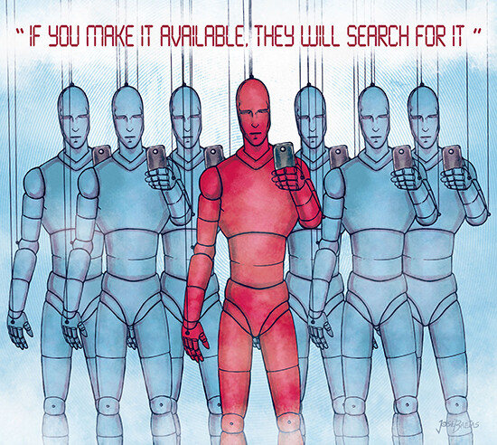

::: {.caption}
Artwork by José Baetas for *Kasma Magazine*
:::
:::
::::

---

## Exercise Preview: Online Account Biopsy {.embed-slide}

::: {.embed-frame style="width:100%;height:100%;margin:0;"}
<iframe
  src="https://doethics.fun/exercises/online-account-biopsy.html"
  title="Online Account Biopsy exercise"
  loading="lazy"
  style="width:100%;height:100%;border:none;display:block;"
  data-external="1">
</iframe>
:::

::: {.embed-overlay}
[Open in new tab](https://doethics.fun/exercises/online-account-biopsy.html)
:::

---

## Questions / Comments / Etc.?

---

## That's all for today! See you Wednesday!

---

# Privacy as Contextual Integrity {.title-slide data-menu-title="Week 5, Day 2"}

CS 377, Week 5, Day 2 🟦 LaSalle 🟦

---

# Privacy as Contextual Integrity {.title-slide .photo-title data-state="photo-title" background-image="../assets/blue-line-stops/stop13-lasalle-a.jpg" background-size="cover" data-menu-title="Week 5, Day 2"}

CS 377, Week 5, Day 2 🟦 LaSalle 🟦

<!-- image source: LaSalle station, photo by Cragin Spring -->

---

## {.photo-only data-state="photo-only" background-image="../assets/blue-line-stops/stop13-lasalle-a.jpg" background-size="cover"}

---

## Map for Today

:::: columns
::: {.column width="55%"}
- Shuffle seats
- Preview "online account biopsy" exercise
- Mini-lecture: contextual integrity
- Privacy policy demo
- Privacy policy exercise
- Digital rights and proposed laws
:::

::: {.column width="40%"}

:::
::::

---

## Nearby Event of Interest! {.embed-slide}

::: {.embed-layout .embed-full}
::: {.embed-frame style="width:100%;height:100%;margin:0;"}
<iframe
  src="https://www.cj2026.northwestern.edu"
  title="Nearby Event of Interest"
  loading="lazy"
  style="width:100%;height:100%;border:none;display:block;"
  data-external="1">
</iframe>
:::
:::

---

## 🔀 Seat Shuffle {.embed-slide}

::: {.embed-layout}
::: {.embed-copy}
- Shuffle seats!
- Enter a seed and shuffle

[Open in a new tab](https://doethics.fun/in-progress/visual-seat-shuffle.html)
:::

::: {.embed-frame style="position:absolute;top:0;right:0;bottom:52px;width:38%;margin:0;border-radius:0 6px 6px 0;border:2px solid #d8d8d8;"}
<iframe
  src="../in-progress/visual-seat-shuffle.html"
  title="Visual Seat Shuffle"
  data-external="1">
</iframe>
:::
:::

---

## Online Account Biopsy

- Introduce yourselves at your table
- Discuss which app or website you want to use
- Find the "request my data" option in the app
- This will be used for your "online account biopsy" exercise
- Should only take ~5 minutes

---

# Digital Rights {.title-slide .section-header}

---

## Warm-up Discussion: What Are Rights?

- What comes to mind when you hear the word "rights"?
- What are some examples of rights you have?
- What are some rights you want to have, but are unsure whether you have?
- What are some examples of "human rights"?
- Where do these rights come from?
- What is a privilege compared to a right?

---

## Rights and Laws

- Where do rights come from? Declarations, constitutions, statutes, courts
- A right without an enforcement mechanism behaves differently from one with it
- What is a privilege compared to a right?

---

## Eleanor Roosevelt and the UDHR {.figure-slide .framed-figure}

::: {.source-top}
[Universal Declaration of Human Rights (United Nations, 1948)](https://www.un.org/en/about-us/universal-declaration-of-human-rights)
:::

{style="max-height:520px;"}

::: {.figure-caption}
Eleanor Roosevelt with the English-language text of the UDHR, Lake Success, New York, November 1949. [FDR Presidential Library via Wikimedia Commons](https://commons.wikimedia.org/wiki/File:Eleanor_Roosevelt_UDHR.jpg), CC BY 2.0
:::

---

## Eleanor Roosevelt on the UDHR {.quote-slide}

> "It is not a treaty; it is not an international agreement. It is not and does not purport
> to be a statement of law or of legal obligation. It is a declaration of basic principles
> of human rights and freedoms, to be stamped with the approval of the General Assembly
> by formal vote of its members, and to serve as a common standard of achievement for
> all peoples of all nations."
>
> — Eleanor Roosevelt

---

## Blueprint for an "AI Bill of Rights"

- Office of Science and Technology Policy (2022)
- "Intended to support the development of policies and practices that protect civil rights and promote democratic values in the building, deployment, and governance of automated systems"

---

## Activity: Proposed Digital Rights

Review each proposed right — strengths? Weaknesses? Examples where it would come into play?

::: {.incremental}
- A: "You should be protected from unsafe or ineffective systems."
- B: "You should not face discrimination by algorithms and systems should be used and designed in an equitable way."
- C: "You should be protected from abusive data practices via built-in protections and you should have agency over how data about you is used."
- D: "You should know that an automated system is being used and understand how and why it contributes to outcomes that impact you."
- E: "You should be able to opt out, where appropriate, and have access to a person who can quickly consider and remedy problems you encounter."
- F: "You should have the ability to request deletion of your personal data and digital traces from automated systems and databases."
- G: "You should have the right to repair, modify, and maintain automated systems that you own or that significantly impact your daily life."
:::

---

## That's all for today!

See you next week!

---

# Appendix: Leftover Slides {.title-slide .section-header}

Slides still missing a visual, or cut from the running order. Not part of the planned sequence.

---

## Notes on Unit 2

<!-- image: Unit 2 overview / structure slide -->
- TODO: add image — *Unit 2 overview / structure slide*

---

## What Is Content Moderation?

<!-- image: content moderation framing diagram -->
- TODO: add image — *content moderation framing diagram*

---

## Moderation Labor at OpenAI

- Moderators label and filter toxic and/or explicit text for model training
- Violence, hate speech, explicit material
- Larger projects in 2021–2022

::: {.source-top}
[Billy Perrigo, "Exclusive: OpenAI Used Kenyan Workers on Less Than $2 Per Hour to Make ChatGPT Less Toxic," *TIME* (January 18, 2023)](https://time.com/6247678/openai-chatgpt-kenya-workers/)
:::

<!-- image: TIME's lead photo is copyrighted; link above stands in until a licensed image is chosen -->
- TODO: add image — *reporting on OpenAI content moderation labor (TIME lead photo is © — needs a licensed substitute)*

::: {.figure-caption}
Background on moderation labor: Sarah T. Roberts, [*Behind the Screen*](https://yalebooks.yale.edu/book/9780300261479/behind-the-screen/) (Yale University Press, 2019)
:::

---

## Marginal Content at Twitter

<!-- image: internal Twitter documentation — original source unknown; see links below for substitutes -->
- TODO: add image — *Twitter internal moderation documentation example*

::: {.figure-caption}
On "borderline" content that approaches but does not cross the policy line: Mark Zuckerberg, ["A Blueprint for Content Governance and Enforcement"](https://web.archive.org/web/20200107062302/https://www.facebook.com/notes/mark-zuckerberg/a-blueprint-for-content-governance-and-enforcement/10156443129621634/) (2018, via the Internet Archive — the original Facebook note is gone). On how platforms write and phrase these rules: [Schaffner et al., *CHI 2024*](https://doi.org/10.1145/3613904.3642333)
:::

---

## Contextual Integrity Preview

<!-- image: no openly-licensed CI diagram located; the published figures (Nissenbaum 2004, Malkin 2022) are under publisher copyright. Candidate: draw an original SVG in the house style. -->
- TODO: add image — *contextual integrity diagram (subject, sender, receiver, data category, transmission principles)*

::: {.figure-caption}
Primary source: Helen Nissenbaum, ["Privacy as Contextual Integrity,"](https://digitalcommons.law.uw.edu/wlr/vol79/iss1/10/) *Washington Law Review* 79(1), 2004 — open access
:::

---

## Contextual Integrity: The Five-Tuple Model

<!-- image: contextual integrity improved figure (Nathan Malkin) -->
- TODO: add image — *contextual integrity improved figure (Nathan Malkin)*

- **(subject, sender, recipient, information type, transmission principle)**

| Element | Description |
|---|---|
| Subject | The individual the information is about |
| Sender | Person/entity sending the information |
| Recipient | Person/entity receiving the information |
| Type | Category of information |
| Principle | Conditions or constraints for sharing |

*From Nathan Malkin, "Contextual Integrity, Explained: A More Usable Privacy Definition"*

---

## From 1949 to 2022

<!-- image: side-by-side of the two documents; both are freely reproducible (UN + US government works) -->
- TODO: add image — *UDHR 1949 → AI Bill of Rights 2022 comparison*

::: {.figure-caption}
Both primary documents: [Universal Declaration of Human Rights](https://www.un.org/en/about-us/universal-declaration-of-human-rights) (United Nations, 1948) and [Blueprint for an AI Bill of Rights](https://bidenwhitehouse.archives.gov/ostp/ai-bill-of-rights/) (OSTP, 2022 — served from the Biden White House archive since the live whitehouse.gov page was taken down)
:::

---

## Privacy — parked

The privacy sections below were pulled out of the running order. Reinstate before Day 2.

---

# Introduction to Privacy {.title-slide .section-header}

---

## Intro to Privacy

---

## Table Discussion: What Is Privacy?

- What comes to mind when you think of privacy?
- What are some examples of privacy controls?
- What are examples of privacy violations?
- Can you propose a definition of privacy?

---

## Defining Privacy

- Often conceptualized as a **right**
- Often associated with protection, security, safety
- In celebrity / paparazzi context: "the right to be left alone"
- Framework we will explore: **contextual integrity**
  - "Appropriate flows of information"
  - Subject, sender, and receiver

::: {.figure-caption}
Background reading: [SEP, *Privacy*](https://plato.stanford.edu/entries/privacy/) and [SEP, *Privacy and Information Technology*](https://plato.stanford.edu/entries/it-privacy/)
:::

---

# Contextual Integrity {.title-slide .section-header}

---

## Mini-lecture: Privacy as Contextual Integrity

---

## Perspectives on Privacy

- **Control over information** — analogous to property rights, managing "data boundaries"
- **Adherence to rules** (contextual norms)
- Something else?

---

## Contextual Integrity

:::: columns
::: {.column width="58%"}
- Privacy as **appropriate data flows**
- Beyond binary (e.g. public/private)
- Appropriateness depends on **specific contexts**
- Contexts are governed by **norms** (also called expectations)
- Theorized by **Helen Nissenbaum**
  - University of the Witwatersrand → M.A. and PhD from Stanford

[Nissenbaum, "Privacy as Contextual Integrity," *Washington Law Review* 79(1), 2004](https://digitalcommons.law.uw.edu/wlr/vol79/iss1/10/)
:::

::: {.column .portrait-solo width="38%"}

::: {.caption}
Helen Nissenbaum. Photo: [CMU CyLab](https://www.cylab.cmu.edu/events/2023/02/15-seminar-nissenbaum.html), 2023
:::
:::
::::

---

## Data Types

Information about a data subject can be varied:

- Health information
- Biometric data
- Relationships
- Location history
- Employment history
- Financial / purchasing history
- Espoused viewpoints

---

## Common Transmission Principles

- Existence of a warrant / court order
- Consent of the subject (or parent/guardian if minor)
- Reciprocity
- Authority / legal entitlement
- Chatham House rule
- Mandatory disclosure
- Confidentiality
- Commercial benefit

---

## Two Principles, Illustrated

- **Consent** — the data subject makes an informed agreement
- **Confidentiality** — the recipient keeps the information secret
  - Example: a therapist keeps client sessions confidential

---

# Contextual Integrity Examples {.title-slide .section-header}

---

## Example: Student Grades (1)

Dr. Bandy is offered $100 from a marketing corporation seeking email addresses and grades from all students in CS 377.

- Sender? Recipient? Subject? Data type? Principle? Purpose?

---

## Example: Student Grades (2)

Dr. Bandy is approached by the chair of the CS department, who requests recent grades for CS 377.

- Sender? Recipient? Subject? Data type? Principle? Purpose?

---

## Example: Job Interviews

In job interviews, interviewers are not allowed to ask candidates about their religious practices.

- Sender? Recipient? Subject? Data type? Principle? Purpose?

---

## Example: Raine v. OpenAI

- Ongoing lawsuit (filed August 2025) by parents of Adam Raine
- OpenAI: *"We are currently not referring self-harm cases to law enforcement to respect people's privacy given the uniquely private nature of ChatGPT interactions"*
- Chat logs later shared by family
- Transmission principles at issue: parental/guardian consent, legal compulsion, "greater good"

---

# Privacy Policies {.title-slide .section-header}

---

## Group Exercise: Privacy Policies

- See handout — choose a company:
  - YouTube, Snapchat, TikTok, Anthropic, Amazon, Instagram, Google, Reddit, Facebook, LinkedIn, Apple, others
- Analyze their privacy policy using contextual integrity
- You can leave once you turn in your completed sheet

---

## ChatGPT / OpenAI Policy: What's Collected

::: {.source-top}
[OpenAI Privacy Policy](https://openai.com/policies/row-privacy-policy/)
:::

- Name, contact information, date of birth
- Prompts, files, images
- Contact data (if shared)
- Log data (via direct input, third-party data, inference)

---

## ChatGPT / OpenAI Policy: Third Parties

- "trusted security and safety partners"
- "advertisers and other data partners" (e.g. info about purchases from advertisers)
- "To assist in meeting business operations needs"

---

## ChatGPT / OpenAI Policy: Location Data

- "General area" based on IP address
- More precise GPS info for other services
- Purposes: "protect your account by detecting unusual login activity" and "to provide more accurate responses"

---

## ChatGPT / OpenAI Policy: Retention

- Temporary chats automatically deleted within 30 days
- Other info retained until deletion
- *"In some cases, we need to retain Personal Data for longer even after you delete it, for example because we are legally required to, to address fraud and abuse, for security reasons, or for financial record-keeping purposes"*

---

## ChatGPT / OpenAI Policy: Length

- About 3,000 words; 5–6 pages
- Seems to have stayed about the same length over time

---

## Overview: Federal Privacy Laws in the U.S.

| Law | Year | Covers |
|---|---|---|
| [FERPA](https://www.law.cornell.edu/uscode/text/20/1232g) | 1974 | Student education records |
| [HIPAA](https://www.hhs.gov/hipaa/for-professionals/privacy/index.html) | 1996 | Health information |
| [COPPA](https://www.ftc.gov/legal-library/browse/rules/childrens-online-privacy-protection-rule-coppa) | 1998 | Children under 13 online |
| [GLBA](https://www.ftc.gov/business-guidance/privacy-security/gramm-leach-bliley-act) | 1999 | Financial institutions |
| [Children's Internet Protection Act](https://www.fcc.gov/consumers/guides/childrens-internet-protection-act) | 2000 | Schools and libraries |

There is no single comprehensive federal privacy law — coverage is sectoral.

---

# References & Credits {.sources}

1. GitHub source: <https://github.com/jackbandy/ethical-issues-in-computing-uic/blob/main/docs/slides/week5.md>.
2. Tarleton Gillespie, [*Custodians of the Internet*](https://tarletongillespie.org/Gillespie_CUSTODIANS_print.pdf) (Yale University Press, 2018) — full text released by the author under CC BY-NC-SA 4.0; cover art from [Yale University Press](https://yalebooks.yale.edu/book/9780300261431/custodians-of-the-internet/), © Yale University Press.
3. Tarleton Gillespie, ["Content Moderation, AI, and the Question of Scale"](https://doi.org/10.1177/2053951720943234), *Big Data & Society* (2020).
4. Nick Hopkins, ["Revealed: Facebook's internal rulebook on sex, terrorism and violence"](https://www.theguardian.com/news/2017/may/21/revealed-facebook-internal-rulebook-sex-terrorism-violence), *The Guardian* (2017) — the "Credible Violence" training slide reproduced here is that story's figure, © Guardian News & Media / Facebook, used for classroom commentary on the leaked rulebook.
5. Nathan Malkin, ["Contextual Integrity, Explained"](https://doi.org/10.1109/MSEC.2022.3201585), *IEEE Security & Privacy* (2022).
6. White House OSTP, [Blueprint for an AI Bill of Rights](https://bidenwhitehouse.archives.gov/ostp/ai-bill-of-rights/) (2022).
7. Schaffner et al., ["Community Guidelines Make this the Best Party on the Internet"](https://doi.org/10.1145/3613904.3642333), *CHI 2024*.
8. Helen Nissenbaum, ["Privacy as Contextual Integrity"](https://digitalcommons.law.uw.edu/wlr/vol79/iss1/10/), *Washington Law Review* 79(1) (2004) — open access.
9. Stanford Encyclopedia of Philosophy, [*Privacy*](https://plato.stanford.edu/entries/privacy/) and [*Privacy and Information Technology*](https://plato.stanford.edu/entries/it-privacy/).
10. Espen Egil Hansen, ["Dear Mark…"](https://www.aftenposten.no/meninger/kommentar/i/G892Q/dear-mark-i-am-writing-this-to-inform-you-that-i-shall-not-comply-with-your-requirement-to-remove-this-picture), *Aftenposten* (2016) — open letter on the "Terror of War" removal.
11. Billy Perrigo, ["OpenAI Used Kenyan Workers on Less Than $2 Per Hour"](https://time.com/6247678/openai-chatgpt-kenya-workers/), *TIME* (2023).
12. Sarah T. Roberts, [*Behind the Screen*](https://yalebooks.yale.edu/book/9780300261479/behind-the-screen/) (Yale University Press, 2019).
13. Mark Zuckerberg, ["A Blueprint for Content Governance and Enforcement"](https://web.archive.org/web/20200107062302/https://www.facebook.com/notes/mark-zuckerberg/a-blueprint-for-content-governance-and-enforcement/10156443129621634/) (2018), via the Internet Archive.
14. Statutes: [First Amendment](https://constitution.congress.gov/constitution/amendment-1/), [47 U.S.C. § 230](https://www.law.cornell.edu/uscode/text/47/230), [FERPA](https://www.law.cornell.edu/uscode/text/20/1232g), [HIPAA Privacy Rule](https://www.hhs.gov/hipaa/for-professionals/privacy/index.html), [COPPA](https://www.ftc.gov/legal-library/browse/rules/childrens-online-privacy-protection-rule-coppa), [GLBA](https://www.ftc.gov/business-guidance/privacy-security/gramm-leach-bliley-act), [CIPA](https://www.fcc.gov/consumers/guides/childrens-internet-protection-act).
15. [Universal Declaration of Human Rights](https://www.un.org/en/about-us/universal-declaration-of-human-rights) (United Nations, 1948).
16. Eleanor Roosevelt with UDHR photo, 1949, [via Wikimedia Commons](https://commons.wikimedia.org/wiki/File:Eleanor_Roosevelt_UDHR.jpg), CC BY 2.0.
17. Samuel F. B. Morse, *DeWitt Clinton*, [Metropolitan Museum of Art via Wikimedia Commons](https://commons.wikimedia.org/wiki/File:De_Witt_Clinton_MET_DT2056.jpg), CC0; Anthony Imbert, *Grand Canal Celebration* (1825), [Wikimedia Commons](https://commons.wikimedia.org/wiki/File:New_York_celebration_for_the_Erie_Canal_1825.png), public domain.
18. Ethics in the news: Herb Scribner, ["Here's how iPhone users can get up to $95 from Apple's AI delay"](https://www.axios.com/2026/09/21/apple-iphone-siri-ai-settlement-paid-eligibility), *Axios* (September 21, 2026), lead photo by Michael M. Santiago/Getty Images; Mark Sweney and Robert Booth, ["Nvidia boss says there is '0% chance' AI destroys the world by 2030"](https://www.theguardian.com/technology/2026/sep/21/nvidia-boss-jensen-huang-dismisses-warnings-ai-destroys-world-anthropic), *The Guardian* (September 21, 2026), lead photo by Manami Yamada/Reuters. Both cards are facsimiles built from each story's own headline, deck, photo, and byline — not captures of the publications' page designs.
19. Slide deck built with [Quarto](https://quarto.org/) and Reveal.js.
