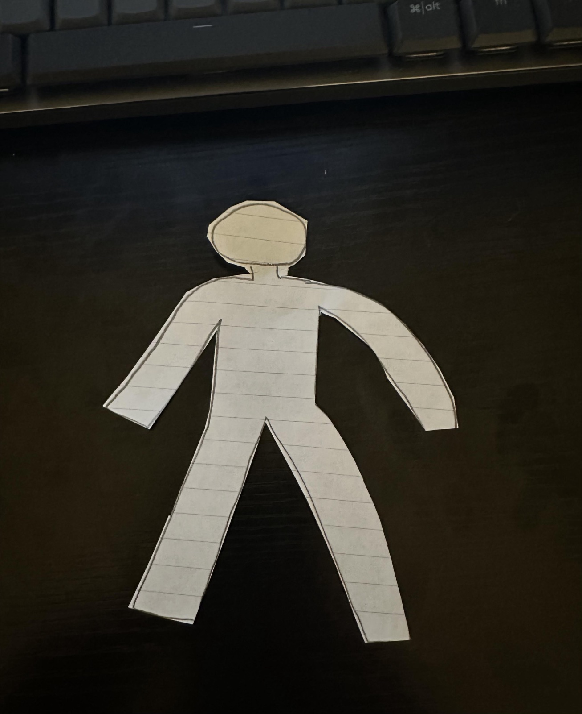
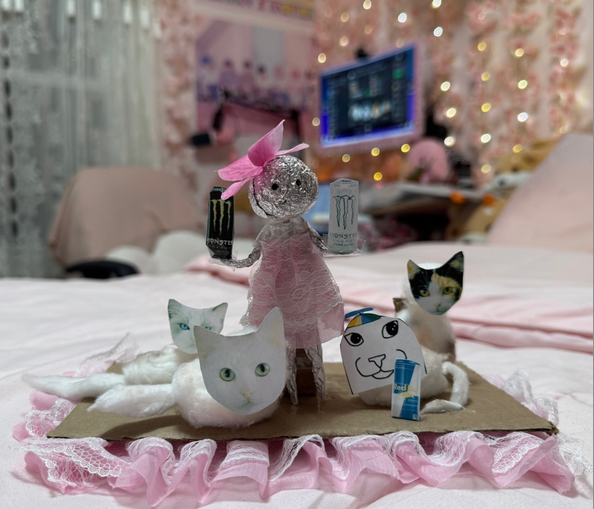
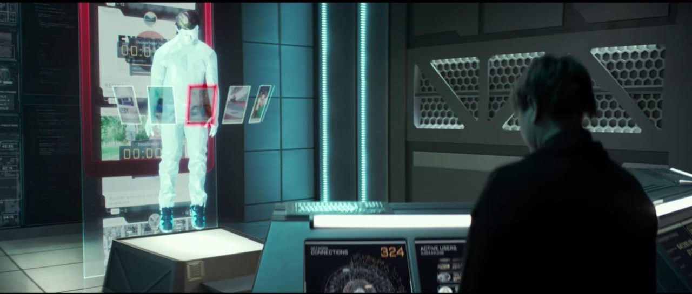

# Stories, Continued {.title-slide .photo-title data-state="photo-title" background-image="../assets/blue-line-stops-better/stop14-jackson-c.jpg" background-size="cover" data-menu-title="Week 6, Day 1"}

CS 377, Week 6, Day 1 🟦 Jackson 🟦

---

## {.photo-only data-state="photo-only" background-image="../assets/blue-line-stops-better/stop14-jackson-c.jpg" background-size="cover"}

---

## Administrivia

:::: columns
::: {.column width="55%"}
- Asynchronous classes next week
	- Read read read!
- Food in your Feed: some reflections still missing
- Upcoming due dates
- What you liked / wished
- Discuss "Message in a Bottle"
- Preview "Dolly"
:::

::: {.column width="40%"}

:::
::::

---

## No Class Meetings Next Week!

Both classes next week are asynchronous. Do not come to class.

A few things due soon, see Canvas for details!

---

## Free Write {.embed-slide}

::: {.embed-layout .golden-columns}
::: {.embed-copy}
- Turn off phones, laptops, etc.
- Get out your new notebooks! 😃
- Write whatever!
- If you need prompts:
	- What have you learned so far in 377?
	- What do you still want to learn in 377?
	- What stuck with you from the story?
:::

<!-- TODO: confirm free-write prompt -->

::: {.embed-frame}
<iframe
  src="../timer/index.html"
  title="CTA-style countdown timer"
  loading="lazy"
  data-external="1">
</iframe>
:::
:::

---

## Exercises

:::: columns
::: {.column width="48%"}
**✅ Account Biopsy**

- Use the data you requested (best if csv / json)
- Plan some questions and plots
- (Instructor used Python, pandas, seaborn, and an LLM-based coding system)
- Turn in your top findings and a brief meta-reflection
:::

::: {.column width="48%"}
**⏳ Scrap Doll**

- What is captured by the trace data from the "biopsy?"
- Create that essence in the form of a physical doll
- Materials: yarn, tape, tin foil, bags, wire, cardboard, etc.
- Turn in a picture of it
:::
::::

---

## The Doll

::: {style="display:grid;grid-template-columns:400px 200px 1fr;grid-template-rows:repeat(3,162px);gap:12px 24px;align-items:center;font-size:0.9em;"}
::: {.fragment fragment-index=1}
{style="width:400px;height:162px;object-fit:cover;margin:0;"}
:::

::: {.fragment fragment-index=1 style="text-align:center;"}
Generic Model
:::

::: {style="grid-column:3;grid-row:1 / 4;display:flex;flex-direction:column;align-items:center;gap:12px;"}
::: {.fragment fragment-index=4}
{style="height:240px;width:auto;margin:0;"}
:::

::: {.fragment fragment-index=5}
{style="height:240px;width:auto;margin:0;"}
:::
:::

::: {.fragment fragment-index=2}
{style="width:400px;height:162px;object-fit:cover;margin:0;"}
:::

::: {.fragment fragment-index=2 style="text-align:center;"}
Early Model
:::

::: {.fragment fragment-index=3}
{style="width:400px;height:162px;object-fit:cover;margin:0;"}
:::

::: {.fragment fragment-index=3 style="text-align:center;"}
Detailed Model
:::
:::

---

# "Message in a Bottle" {.title-slide .section-header}

---

## Story Overview: "Message in a Bottle"

:::: columns
::: {.column width="50%"}
- Written by Nalo Hopkinson
- Central character is Greg
- Initial thoughts or questions?
:::

::: {.column .portrait-solo width="50%"}

::: {.caption}
Nalo Hopkinson at the Hugo Award Ceremony, August 2017. Photo: [Sanna Pudas](https://commons.wikimedia.org/wiki/File:Nalo_Hopkinson_at_the_Hugo_Award_Ceremony_2017,_Worldcon_in_Helsinki.jpg), CC BY 4.0
:::
:::
::::

---

## Table Discussion: "Message in a Bottle" {.embed-slide}

::: {.embed-layout .golden-columns}
::: {.embed-copy}
- What happened in this story? What was "the twist"?
- Describe what Greg values throughout the story. How does he decide what is valuable? How does it change?
- What values seem to inform Kamla's decisions? How do they compare to Greg's? Which seem similar, and which seem different?
- Other thoughts? Ideas?
:::

::: {.embed-frame}
<iframe
  src="../timer/index.html"
  title="CTA-style countdown timer"
  loading="lazy"
  data-external="1">
</iframe>
:::
:::

---

## "The Excavations"

:::: columns
::: {.column width="52%"}
- Greg's exhibit, inspired by Russ's "anthill escapade"
- "Historical artifacts that the researchers tossed aside in their zeal to get at the iconic past…"
  - A rubber boot, a plastic jug, a shell...
- "Don't you think the living are more important?"
:::

::: {.column width="45%"}

:::
::::

---

## "The Excavations" and Utilitarianism

The "natural gallery" grant touches on questions from utilitarian ethics:

- **Whose well-being?** All species: mollusc, sea cucumber, etc.
- **What is being used to define good/happiness/utility?**
- **When is the measure of success taken?**

---

## Art and Change {.quote-slide}

> Art helps us know how to do change.
>
> — Kamla, "Message in a Bottle"

---

## Preview: "Dolly"

:::: columns
::: {.column width="50%"}
- Written by Elizabeth Bear (2011)
- A robot kills a billionaire!
- Read before Wednesday: [full text at Apex Magazine](https://www.apexbookcompany.com/blogs/apex-magazine/dolly), or the [34-minute audio version](https://shows.acast.com/starshipsofa/episodes/starshipsofa-no-204-paul-cornell-elizabeth-bear)
	- Upload a picture of handwritten notes
- Apple has rights to a film adaptation starring Florence Pugh ([Wikipedia](https://en.wikipedia.org/wiki/Dolly_(story)))
:::

::: {.column .portrait-solo width="50%"}

::: {.caption}
Elizabeth Bear at the 2017 Phoenix Comicon. Photo: [Gage Skidmore](https://commons.wikimedia.org/wiki/File:Elizabeth_Bear_by_Gage_Skidmore.jpg), CC BY-SA 3.0
:::
:::
::::

# Any questions? {.title-slide .section-header}

---

## That's all for today!

See you Wednesday!

---

# Inequality, Justice, Stories, etc.{.title-slide data-menu-title="Week 6, Day 2"}

<!-- NOTICE: Draft from old-slides/pdf-versions/10 Message in a Bottle.pdf, 12 Privacy and Power.pdf, and 14 Digital Divide.pdf. Review and edit before use. -->

CS 377, Week 6, Day 2 🟦 Washington 🟦

---

# Inequality, Justice, Stories, etc. {.title-slide .photo-title data-state="photo-title" background-image="../assets/blue-line-stops-better/stop16-washington-a.jpg" background-size="cover" data-menu-title="Week 6, Day 2"}

CS 377, Week 6, Day 2 🟦 Washington 🟦

---

## {.photo-only data-state="photo-only" background-image="../assets/blue-line-stops-better/stop16-washington-a.jpg" background-size="cover"}

---

## Administrivia

:::: columns
::: {.column width="55%"}
- Keep reading your book!
- Grading update this week
- Canvas updates and upcoming deadlines
:::

::: {.column width="40%"}

:::
::::

---

## Agenda for Today

:::: columns
::: {.column width="55%"}
- Shuffle seats
- Debrief "account biopsy" exercise
- The scrap doll
- Privacy and power: Ida B. Wells
- Mini-lecture: digital inequality
- Preview "Codename Delphi"
:::

::: {.column width="40%"}

:::
::::

---

## 🔀 Seat Shuffle

<!-- image: room diagram — lectern "0", tables 1–8, projector screens, door -->
- TODO: add image — *room diagram — lectern "0", tables 1–8, projector screens, door*

---

## What might an advertiser infer from your location?

::: {.fragment}
- DePaul, Chicago, Northwestern?
- Naperville, Evanston?
:::

---

# Biopsy Debrief {.title-slide .section-header}

---

## Debriefing the Biopsy Exercise

<!-- image: example student account biopsy analyses (with permission from prior semester) -->
- TODO: add image — *example student account biopsy analyses (with permission from prior semester)*

---

## Table Discussion: Account Biopsy Debrief

- How did you analyze the data?
- Any insights about your habits?
- Any changes you plan to make afterward?
- What did you find surprising and/or fascinating?

---

# The Account Biopsy and the Doll {.title-slide .section-header}

---

## Account Biopsy: Example Analyses

<!-- image: example student account biopsy analyses (anonymized) — placeholder for instructor to add -->
- TODO: add image — *example student account biopsy analyses (anonymized) — placeholder for instructor to add*

---

## The Doll: A Conceptual Model

<!-- image: Generic Model → Early Model → Detailed Model progression -->
- TODO: add image — *Generic Model → Early Model → Detailed Model progression*

---

## What Goes Into the Doll?

- **Generic model** — demographic info, account type
- **Early model** — posting patterns, topics
- **Detailed / fine-tuned model** — specific behaviors, preferences, relationships

<!-- image: doll examples via krokotak.com, etsy, pinterest -->
- TODO: add image — *doll examples via krokotak.com, etsy, pinterest*

---

## Doll Examples

<!-- image: mamapapabubba.com doll example -->
- TODO: add image — *mamapapabubba.com doll example*

---

## Doll Examples from Class

<!-- image: examples from prior semesters (GitHub) -->
- TODO: add image — *examples from prior semesters (GitHub)*

---

# Privacy and Power {.title-slide .section-header}

---

## Warm-Up: Are Data Neutral?

- "Data are neutral"
  - Strong disagree / Disagree / Not sure / Agree / Strong agree

---

## Privacy and Power

---

## Discussion: "The Power Chapter"

*From* Data Feminism *(D'Ignazio & Klein), Chapter 1*

- 15 minutes at your tables
- Feel free to pull up the chapter on your laptop or tablet
- Be ready to share your table's example and one thing you learned
- Bonus: which other chapter(s) from this book would you want to read and discuss?

---

# Contextual Integrity, Revisited {.title-slide .section-header}

---

## Privacy Connections: Contextual Integrity (Revisited)

<!-- image: contextual integrity diagram — sender, receiver, data subject, data category, transmission principles -->
- TODO: add image — *contextual integrity diagram — sender, receiver, data subject, data category, transmission principles*

---

## "Is this an appropriate information flow within the social context?" {.quote-slide}

---

## Contextual Integrity: Information Types and Principles

:::: columns
::: {.column width="48%"}
**Information Types**

- Medical
- Financial
- Location
- Demographic information
- Digital trace data (e.g. browsing history)
:::

::: {.column width="48%"}
**Transmission Principles**

- Confidentiality
- Consent
- Reciprocity
- Entitlement
- Stewardship
- Notice
:::
::::

---

## Case Study: Instagram Real-Time Map

- Sender? Receiver? Subject? Category? Transmission Principles?

<!-- image: Instagram real-time location map example -->
- TODO: add image — *Instagram real-time location map example*

---

## Case Study: Target Pregnancy Prediction

How did this happen?

<!-- image: Target / pregnancy prediction example -->
- TODO: add image — *Target / pregnancy prediction example*

---

## Target Example: Apply the Framework

- Sender? Receiver? Subject? Category? Transmission Principles?
- "It's not just about privacy…"

---

# Ida B. Wells and Data Activism {.title-slide .section-header}

---

## What Do You Know About Ida B. Wells?

<!-- image: Ida B. Wells portrait -->
- TODO: add image — *Ida B. Wells portrait*

---

## Ida B. Wells and Data Activism

- *"A Red Record: Tabulated Statistics and Alleged Causes of Lynchings in the United States, 1892–1893–1894"*
- *"Respectfully submitted to the nineteenth century civilization in 'the land of the free and the home of the brave'"*
- Practices: counterdata, agonistic data collection, data activism, statactivism, citizen science
- Organized with National Equal Rights League (NERL) in Chicago
- Organized a boycott of the World's Columbian Exposition (1893)

---

## Connections: Data as a Tool of Power and Resistance

<!-- image: connections diagram linking Ida B. Wells to contextual integrity to privacy and power -->
- TODO: add image — *connections diagram linking Ida B. Wells to contextual integrity to privacy and power*

---

# Digital Inequality {.title-slide .section-header}

---

## Mini-lecture: Digital Inequality

---

## The "Digital Divide" {.quote-slide}

> "The Internet is one in a long series of information and communications
> technologies — from speech, to printing, movable type, telegraphy,
> telephony, radio, and television — that arguably influenced patterns of
> social inequality by destroying existing competencies and permitting
> early adopters to interact with more people and acquire more information
> over greater distances and in a shorter time."
>
> — *From Unequal Access to Differentiated Use: A Literature Review*

---

## Who Uses the Internet More?

Research from the 1990s and 2000s showed differences along:

::: {.incremental}
- **Region** — "Rates of Internet use are highest in the northeast and far west"
- **Income** — "Internet use rates rise linearly with family income"
- **Education**
- **Age**
:::

---

## From "Digital Divide" to "Digital Inequality"

Key questions that reshaped the research:

::: {.incremental}
- What is "access"? (Device? Broadband? Skills?)
- Which "digital divide"? (there are many)
- How do we measure differences?
- Which inequalities will persist?
- What are people actually *able to do* when online?
:::

---

## Folded Map Project

- Initiative by Tonika Lewis Johnson (Chicago)
- Goal: connect residents on the same street with "mirror" addresses
- Reveals how a single street address means radically different things across the city

<!-- image: Folded Map visualization -->
- TODO: add image — *Folded Map visualization*

---

## Table Activity: Folded Map

- Go to [foldedmapproject.com](https://foldedmapproject.com) → "Interactive Maps" (top right)
- Choose Social, Business, or Schools layer
- Explore and discuss
  - Where are you from? Where do you live? Where do you visit?
  - Try to find mirror addresses

---

## What Is This Map?

**Blockbusting** — targeting areas to make wealthy families sell ("the minorities are moving here!")

<!-- image: blockbusting map of Chicago -->
- TODO: add image — *blockbusting map of Chicago*

---

## Implications

Ads and algorithmic systems can reinforce inequality by influencing:

- Education
- Healthcare
- Housing
- Jobs

Ads range in how helpful or exploitative they can be.

::: {.fragment}
Example ad: "Miracle cure for focus. Ace your midterms."
:::

---

## Preview: "Codename Delphi"

- Written by Linda Nagata
- Main character: Karin
- Explores war, trauma, and work
- Read before next week
- Discussion questions will be posted to Canvas

---

## That's all for today!

See you Wednesday!

---

# Appendix: Leftover Slides {.title-slide .section-header}

Slides that need to be re-organized...

---

# De-Anonymization {.title-slide .section-header .no-index}

---

## Privacy in Data

Two tales of privacy:

- **Tale 1:** Census data (1997)
- **Tale 2:** The Netflix Prize (2007)

---

## Latanya Sweeney

- Faculty at Harvard; PhD from MIT (2001)
- Public Interest Tech Lab; Data Privacy Lab
- Known for:
  - K-anonymity
  - De-anonymization research
  - Algorithmic bias research

---

## De-Anonymization: Census Data (1997) {.quote-slide}

> "For twenty dollars I purchased the voter registration list for
> Cambridge Massachusetts and received the information on two diskettes."
>
> — Latanya Sweeney (2000)

---

## De-Anonymization: Hospital Data {.quote-slide}

> "Most states (44 of 50 or 88%) collect hospital discharge data.
> Many of these states have subsequently distributed copies of these
> data to researchers, sold copies to industry and made versions
> publicly available."
>
> — Latanya Sweeney (2000)

---

## The Re-Identification Problem {.quote-slide}

> "The greater the number and detail of attributes reported about an entity,
> the more likely that those attributes combine uniquely to identify the entity."
>
> — Latanya Sweeney (2000)

---

## Why Attributes Combine Uniquely

"Given a random sample of 500 people, there are at least ⌈500 / 365⌉ = 2 people with the same birthday, because there are only 365 possible birthdays."

Each additional attribute (birthday, ZIP code, gender…) narrows the field much faster than intuition suggests.

---

## De-Anonymization Demo

Try it yourself: [aboutmyinfo.org/identity](https://aboutmyinfo.org/identity)

---

# K-Anonymity {.title-slide .section-header .no-index}

---

## K-Anonymity Demo

**Full dataset:**

| Name | Age | Team | Stop |
|---|---|---|---|
| Alice | 24 | Team Jeremiah | Grand |
| Bob | 28 | Team Conrad | Chicago |
| Carol | 27 | Team Conrad | Division |
| Dave | 24 | Team Jeremiah | Damen |
| Erin | 29 | Team Conrad | Western |

---

## K-Anonymity Demo: Names Suppressed

| Name | Age | Team | Stop |
|---|---|---|---|
| * | 24 | Team Jeremiah | Grand |
| * | 28 | Team Conrad | Chicago |
| * | 27 | Team Conrad | Division |
| * | 24 | Team Jeremiah | Damen |
| * | 29 | Team Conrad | Western |

---

## K-Anonymity Demo: Ages Generalized

| Name | Age | Team | Stop |
|---|---|---|---|
| * | 20 < Age ≤ 30 | Team Jeremiah | Grand |
| * | 20 < Age ≤ 30 | Team Conrad | Chicago |
| * | 20 < Age ≤ 30 | Team Conrad | Division |
| * | 20 < Age ≤ 30 | Team Jeremiah | Damen |
| * | 20 < Age ≤ 30 | Team Conrad | Western |

---

## K-Anonymity Demo: Stops Suppressed

| Name | Age | Team | Stop |
|---|---|---|---|
| * | 20 < Age ≤ 30 | Team Jeremiah | * |
| * | 20 < Age ≤ 30 | Team Conrad | * |
| * | 20 < Age ≤ 30 | Team Conrad | * |
| * | 20 < Age ≤ 30 | Team Jeremiah | * |
| * | 20 < Age ≤ 30 | Team Conrad | * |

This data has **2-anonymity** with respect to Age, Team: for any combination of these attributes found in any row, there are always at least 2 rows with those exact attributes.

---

## K-Anonymity Limitations

- Limited to one dataset (can still be linked to other records)
- All values are potentially identifying with "auxiliary" data
- Inferences just from knowing someone is in the dataset
  - e.g. "He has cancer, a heart disease, or viral infection"
- More formal attacks with background knowledge

---

# The Netflix Prize {.title-slide .section-header .no-index}

---

## Arvind Narayanan

- Directs "Center for Information Technology Policy" (Princeton)
- Degrees from Indian Institute of Technology Madras (2004)
- PhD from UT-Austin (2009)
- Significant contributions: algorithmic fairness, de-anonymization, cryptography

---

## Netflix Prize De-Anonymization

Netflix released a dataset of ~500,000 users and 100 million ratings (with names replaced by user IDs) for a $1M prize competition.

<!-- image: Netflix prize dataset sample with movie ratings and dates -->
- TODO: add image — *Netflix prize dataset sample with movie ratings and dates*

---

## Was the Netflix Dataset Anonymous? {.quote-slide}

Ratings for popular movies are less informative (e.g. top 10 most-rated: *Dark Knight, Fight Club, Godfather, Forrest Gump, The Matrix*…)

Ratings for **obscure** movies can de-identify:

- Movie-watching sequences become increasingly unique
- With only 8 movie ratings (even 2 possibly wrong) and dates (up to 2 weeks off), you can uniquely identify 99% of records

---

## Linking Netflix Data to IMDb

| Source | Record | Title | Date |
|---|---|---|---|
| Netflix data | User 172373 | The Dark Knight | December 30, 2004 |
| Netflix data | User 516182 | Jurassic Park | May 14, 2009 |
| IMDb data | (public review) | Jurassic Park | May 14, 2009 |

Public reviews carry names. Matching a handful of titles and dates re-attaches them.

---

## Takeaways: Anonymous Datasets

- Anonymous datasets still have risks
- Can be combined with already-identified data (e.g. IMDb)
- Apply contextual integrity: subject, sender, recipient, type, transmission principle?

---

# Why Short Stories? {.title-slide .section-header .no-index}

---

## Why Short Stories?

::: {.incremental}
- **Defamiliarization** — detach from preconceptions, expose your assumptions
- **Address recognizable human situations and problems** — explore them in terms of unfamiliar settings or technology
- **Normative + descriptive analysis** — both "is it right?" and "who is affected?"
- **It can be fun!**
:::

*Burton, Goldsmith, & Mattei (2018). "How to teach computer ethics through science fiction." CACM.*

---

## Some Examples of Sci-Fi Ethics Cases

<!-- image: examples of sci-fi/ethics short stories and novels used in ethics courses -->
- TODO: add image — *examples of sci-fi/ethics short stories and novels used in ethics courses*

---

## Recall: Normative and Descriptive Ethics

Stories give us both at once — the **normative** question ("was that right?") and the **descriptive** one ("who was involved, what were the stakes, what led here?").

---

# References & Credits {.sources}

1. GitHub source: <https://github.com/jackbandy/ethical-issues-in-computing-uic/blob/main/docs/slides/week6.md>.
2. Day 1 title photo: [Stairs to Red Line at Jackson](https://commons.wikimedia.org/wiki/File:Stairs_to_Red_Line_at_Jackson.jpg) by Jacob G., via Wikimedia Commons, CC BY-SA 2.0.
3. Latanya Sweeney, ["Simple Demographics Often Identify People Uniquely"](https://dataprivacylab.org/projects/identifiability/paper1.pdf), Carnegie Mellon University (2000).
4. Arvind Narayanan and Vitaly Shmatikov, ["Robust De-anonymization of Large Sparse Datasets"](https://www.cs.utexas.edu/~shmat/shmat_oak08netflix.pdf), *IEEE S&P* (2008).
5. Burton, Goldsmith, & Mattei (2018). ["How to teach computer ethics through science fiction."](https://doi.org/10.1145/3230977) *CACM.*
6. De-anonymization demo: [aboutmyinfo.org/identity](https://aboutmyinfo.org/identity).
7. Day 2 title photo: [Chicago Blue Line Washington station](https://commons.wikimedia.org/wiki/File:Chicago_Blue_Line_Washington_Station.jpg) by Thomas Sly, via Wikimedia Commons, CC BY 2.0.
8. D'Ignazio, C. & Klein, L. (2020). [*Data Feminism*](https://data-feminism.mitpress.mit.edu/), MIT Press.
9. Folded Map Project: [foldedmapproject.com](https://foldedmapproject.com).
10. Sanna Pudas, [Nalo Hopkinson at the Hugo Award Ceremony 2017, Worldcon in Helsinki](https://commons.wikimedia.org/wiki/File:Nalo_Hopkinson_at_the_Hugo_Award_Ceremony_2017,_Worldcon_in_Helsinki.jpg), CC BY 4.0.
11. Gage Skidmore, [Elizabeth Bear](https://commons.wikimedia.org/wiki/File:Elizabeth_Bear_by_Gage_Skidmore.jpg), 2017 Phoenix Comicon, CC BY-SA 3.0.
12. Elizabeth Bear, ["Dolly"](https://www.apexbookcompany.com/blogs/apex-magazine/dolly), *Asimov's Science Fiction* (2011); adaptation note from [Wikipedia](https://en.wikipedia.org/wiki/Dolly_(story)).
13. Slide deck built with [Quarto](https://quarto.org/) and Reveal.js.
